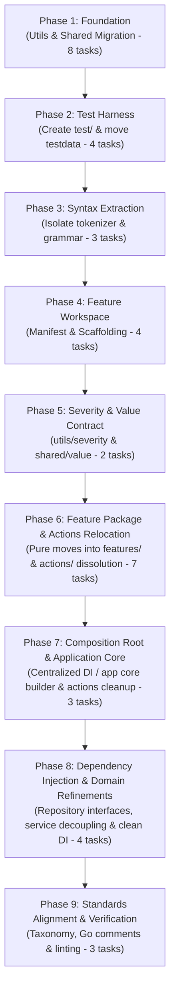

# Architecture Refactoring Plan: Vertical Slice & Domain-Driven Design

This plan outlines the architecture refactoring for the Go application in [app/README.md](app/README.md). It transitions the codebase from an imperative-shell / action-based layout into domain-driven vertical feature slices with elevated domain roots, standardized schema/DTO taxonomy, decoupled comments, and a dedicated end-to-end testing suite.

## Executive Summary & Objectives

The `envx` application is a configuration compiler, secret orchestrator, and execution runtime. Over time, the codebase accumulated architectural friction:
- Application logic was organized by CLI verbs inside [app/internal/actions](app/internal/actions) rather than cohesive domain features.
- Monolithic packages like [app/internal/envmerge](app/internal/envmerge) and [app/internal/config](app/internal/config) combined parsing, syntax lexing, precedence logic, graph substitution, and dependency wiring.
- Struct taxonomy was inconsistent, with `Params`, `Options`, `Config`, and `Input` used interchangeably for domain models, DTOs, and constructors.
- Code comments coupled internal functions to specific callers (such as `main.go` or specific action packages).
- End-to-end integration tests were mixed into [app/internal/cli/root_test.go](app/internal/cli/root_test.go) without a top-level integration test package.

The primary objective is to refactor [app](app) into cohesive vertical slices that improve maintainability, establish clear compiler boundaries, and simplify future feature development.

## Architectural Principles & Package Boundaries

The refactored application is structured around four distinct package tiers:

| Tier | Directory | Allowed Imports | Responsibility & Contract |
| --- | --- | --- | --- |
| **Resources** | `internal/resources/` | Standard library, third-party drivers | Raw infrastructure clients and cryptographic drivers (e.g. Age, NaClBox). Zero domain knowledge. Keeps third-party cryptography isolated and leaves the door open for future external key management providers (e.g., AWS KMS, HashiCorp Vault). |
| **Features** | `internal/features/` | Features (via DI), Resources, Shared, Utils, Standard library | High-cohesion domain vertical slices representing system capabilities. Each slice houses its domain entities, use cases, and file operations, with an optional isolated `cli/` subpackage for CLI presentation when user-facing. Cross-feature dependencies must be explicit, acyclic, and supplied via Dependency Injection. |
| **Shared** | `internal/shared/` | Standard library | The application-specific Shared Kernel. Cross-cutting domain primitives that multiple features must agree upon (status codes, exit code error wrappers). |
| **Utils** | `internal/utils/` | Standard library | Generic, domain-blind utility packages with zero application logic (file I/O, string manipulation, YAML AST helpers, CLI arguments, terminal printers, and ANSI styling). |

### Unified Feature Slices with Isolated CLI Adapters

Rather than creating artificial technical subpackages (`command/`, `query/`, `infra/`) that introduce package stuttering, export pollution, and import cycle hazards, each vertical slice is contained in a single cohesive package with an optional isolated `cli/` subpackage:
- **Clean Go naming**: Symbols are addressed naturally as `workspace.Manifest`, `workspace.NewManifestLoader`, `workspace.CreateWorkspaceCommand`, and `workspace.NewCreateWorkspaceHandler`.
- **Pure domain & application logic**: The slice package owns all domain entities, validation rules, use case handlers, and local file operations, with zero dependency on Cobra or CLI frameworks.
- **Isolated CLI presentation adapter**: When a feature exposes user-facing commands, the `cli/` subpackage is the sole subpackage, importing the feature package and `cobra`. It handles flag binding, argument parsing, output formatting, and translates inputs into domain command/query DTOs.
- **Compiler invariant**: The feature package never imports its `cli/` subpackage, guaranteeing that business logic and file operations remain completely reusable and free of CLI dependencies.
- **System features vs. user features**: Vertical slices are organized around vertical *system* capabilities (what the system can do), not merely user-facing CLI verbs. Features may provide capabilities directly to other system features without exposing CLI commands (for example, `features/privatekey` provides private key resolution and persistent storage to `features/secrets`).
- **Cross-feature dependency injection**: Features can depend on other features when required, provided dependencies are explicit, acyclic, unidirectional, and injected via interfaces or constructor arguments at the composition root.

### Shared vs. Utils

- **`internal/shared/`** is reserved for the DDD Shared Kernel. It contains domain-aware primitives like [app/internal/shared/value/](app/internal/shared/value/) (universal value models, evaluation, and resolution contracts) and [app/internal/shared/exitcode/exitcode.go](app/internal/shared/exitcode/exitcode.go) (process exit code error wrappers). The term `globals` is explicitly avoided to prevent any perception of mutable global state.
- **`internal/utils/`** contains domain-blind helper libraries. The existing [app/internal/printer](app/internal/printer) and [app/internal/style](app/internal/style) packages join the utilities moved from [app/pkg](app/pkg) (`file`, `str`, `yamlx`, `arg`) and the canonical [app/internal/utils/severity](app/internal/utils/severity) package, reflecting their status as reusable terminal formatting and classification tools without business rules.

### Filesystem Operations Strategy (Why `utils/file` is Sufficient)

In an offline CLI compiler and execution supervisor, the local filesystem is the persistence medium. An artificial filesystem abstraction or client in `resources/` (such as `afero.Fs` or an abstract `FileSystem` interface) is intentionally avoided:
1. **Sufficient primitives**: `utils/file` already provides battle-tested atomic writes with POSIX permission preservation (`WriteAtomic`, `WriteAtomicPrivate`), upward directory discovery (`FindUp`), resilient reads, and path resolution.
2. **Reliable testing with `t.TempDir()`**: In Go, tests for filesystem-intensive CLI apps use `t.TempDir()`. This provides real, isolated OS directories with automatic teardown via `t.Cleanup()`, ensuring actual filesystem behavior (file permissions, atomic renames, locks) is validated rather than simulated through in-memory mocks.
3. **Cohesive feature logic**: Features consume `utils/file` and standard library `os` / `path/filepath` functions directly to implement their file operations (manifest loading, secrets storage, namespace resolution).

### Dissolving the `actions/` Directory

The [app/internal/actions](app/internal/actions) directory is eliminated completely. Each command verb and CLI workflow moves to its owning feature slice:
- Cobra command definitions live in `<feature>/cli/`.
- Domain models, mutation workflows, and read/export use cases live in `<feature>/`.

## Target Directory Layout

```text
app/
├── cmd/
│   └── envx/
│       └── main.go                         # Binary entry point, root Cobra assembly, DI wiring
│
├── internal/
│   ├── resources/                          # 📦 Infrastructure Drivers & Cryptographic Engines
│   │   └── cipher/                         # Age, NaClBox implementations & Cipher interface
│   │       ├── age.go
│   │       ├── naclbox.go
│   │       └── cipher.go
│   │
│   ├── features/                           # 📦 Domain Slices (Vertical Bounded Contexts)
│   │   │
│   │   ├── workspace/                      # 🗂️ Workspace Context
│   │   │   ├── create.go                   # Use case: CreateWorkspaceCommand & Handler
│   │   │   ├── loader.go                   # Manifest discovery, YAML loading & validation
│   │   │   ├── manifest.go                 # Domain: Manifest entity & methods
│   │   │   ├── precedence.go               # Precedence cascade rules
│   │   │   ├── strict.go                   # Strict YAML decoding & suggestions
│   │   │   ├── workspace.go                # Domain: Workspace Layout & ProjectRef
│   │   │   ├── templates/                  # Embedded starter workspace templates
│   │   │   └── cli/                        # Cobra create command
│   │   │
│   │   ├── env/                            # 🌿 Environment Resolution & Merge
│   │   │   ├── environment.go              # Domain: Environment entity, Variable, Origin
│   │   │   ├── merge.go                    # Domain: Overlay merge algorithm
│   │   │   ├── flatten.go                  # Dotenv/YAML namespace file flattening & loader
│   │   │   ├── get.go                      # Use case: GetVariable
│   │   │   ├── set.go                      # Use case: SetVariable
│   │   │   ├── explain.go                  # Use case: ExplainEnvironment
│   │   │   ├── diff.go                     # Use case: DiffEnvironments
│   │   │   ├── materialize.go              # Use case: MaterializeEnvironment
│   │   │   ├── syntax/                     # Sub-domain: Tokenizer, expressions, cycle detection
│   │   │   │   ├── grammar.go
│   │   │   │   ├── substitute.go
│   │   │   │   └── token.go
│   │   │   └── cli/                        # Cobra commands: get, set, explain, diff
│   │   │
│   │   ├── privatekey/                     # 🔑 Private Key Resolution & Storage
│   │   │   ├── domain_privatekey.go        # Domain: PrivateKey model & validation
│   │   │   ├── domain_repository.go        # Ports: Resolver and Destination interfaces
│   │   │   ├── service_resolver.go         # Multi-source coordinator (Env -> File/Store)
│   │   │   ├── destination_writer.go       # In-memory / io.Writer destination helper
│   │   │   └── filestore/                  # Local filesystem implementation (.envx/keys)
│   │   │       ├── keyfile.go              # NAME=value grammar & parser
│   │   │       └── destination.go          # Atomic file writer for .envx/keys
│   │   │
│   │   ├── secrets/                        # 🔐 Secrets & Keypairs Bounded Context
│   │   │   ├── domain_secret.go            # Domain: Secret entity, reference syntax
│   │   │   ├── domain_keypair.go           # Domain: Keypair value object & metadata
│   │   │   ├── domain_repository.go        # Ports: Repository interface, Entry, GroupMetadata
│   │   │   ├── service_secrets.go          # Use cases: Secret CRUD & Crypto (get, set, encrypt, decrypt, delete)
│   │   │   ├── service_keypair.go          # Use cases: Keypair operations (generate, rotate, inspect)
│   │   │   ├── service_resolver.go         # Use cases: Runtime reference evaluation (implements value.Evaluator)
│   │   │   ├── service_inventory.go        # Use cases: Workspace audit & diagnostics queries
│   │   │   ├── filestore/                  # Concrete local YAML repository implementation
│   │   │   │   ├── document.go             # YAML AST preservation
│   │   │   │   ├── envelope.go             # Ciphertext envelope codec ("encrypted-<algo>-<base64>")
│   │   │   │   ├── filestore.go            # Implements secrets.Repository via YAML
│   │   │   │   └── filter.go               # Comment-preserving store filtering for pack bundles
│   │   │   └── cli/                        # Cobra commands: secrets, keypair
│   │   │
│   │   ├── runner/                         # 🚀 Process Execution
│   │   │   ├── runner.go                   # Domain: Execution policies, supervisor & signal listener
│   │   │   └── cli/                        # Cobra run command
│   │   │
│   │   ├── emit/                           # 📤 Target Serialization
│   │   │   ├── target.go                   # Domain: Output formats (dotenv, json, k8s)
│   │   │   ├── entry.go                    # Domain: Output entry definitions
│   │   │   ├── emit.go                     # Serializers & emit environment use case
│   │   │   └── cli/                        # Cobra emit command
│   │   │
│   │   ├── pack/                           # 📦 Deployment Bundling & Packaging
│   │   │   ├── bundle.go                   # Domain: Bundle model, isolation rules
│   │   │   ├── layout.go                   # Domain: Path rewriting & sanitization rules
│   │   │   ├── pack.go                     # Packaging engine & directory copying
│   │   │   └── cli/                        # Cobra pack command
│   │   │
│   │   └── validate/                       # 🔍 Workspace Diagnostics
│   │       ├── check.go                    # Domain: Check definition & rule registry
│   │       ├── finding.go                  # Domain: Finding & severity types
│   │       ├── validate.go                 # Workspace validation engine & check evaluation
│   │       └── cli/                        # Cobra validate command
│   │
│   ├── shared/                             # 📦 Application-Wide Shared Primitives
│   │   ├── value/                          # Universal value models, evaluation & resolution contracts
│   │   └── exitcode/                       # Process exit code error wrapping
│   │
│   └── utils/                              # 📦 Low-Dependency Utility Helpers
│       ├── arg/                            # Positional argument helpers
│       ├── file/                           # Atomic file read/write, walk-up search
│       ├── printer/                        # Table formatting, console logging
│       ├── severity/                       # Canonical severity levels (None, OK, Warn, Error)
│       ├── str/                            # String helpers (dedent, formatting)
│       ├── style/                          # ANSI terminal styling
│       └── yamlx/                          # YAML node manipulation helpers
│
└── test/                                   # 🧪 End-to-End & Application Integration Tests
    ├── e2e/                                # CLI & workflow test suites (package e2e_test)
    │   ├── cli_test.go                     # Full binary execution tests
    │   └── workflow_test.go                # Cross-slice workflow tests
    └── testdata/                           # Central test workspaces (basic, manifest, resolve)
```

## Detailed Feature Bounded Contexts

### 1. `features/workspace`
- **Domain Responsibilities**: Encapsulates workspace discovery, project manifest models, declared environments, starter workspace scaffolding, and the multi-tiered precedence cascade (CLI flags > ENVX_* > Project Settings > Global Settings > Terminal Defaults).
- **Core Entities & Models**: `Manifest`, `Layout`, `ProjectRef`, `Settings`, `PrecedenceChain`.
- **Use Cases & Loaders**:
  - `CreateWorkspaceHandler`: Scaffolds starter workspaces (`envx create quick-start`).
  - `ManifestLoader`: Discovers, parses, and performs strict validation on `envx.yaml`.
- **Presentation**: `cli.NewCreateCmd(handler CreateHandler)`.

### 2. `features/env`
- **Domain Responsibilities**: Environment variable synthesis, namespace file overlay merging, key canonicalization, and variable expression substitution.
- **Sub-domain (`syntax/`)**: Encapsulates the reference lexer, tokenizer, symbol table, expression substitution engine, and cycle detection. Completely decoupled from file I/O.
- **Core Entities & Domain Rules**:
  - `environment.go`: Pure domain entities and value objects (`Environment`, `Variable`, `Origin`, `Source`).
  - `merge.go`: The core overlay merge algorithm (layering base namespace files, environment-specific overlays, declaration order last-wins, and affix decoration).
- **Use Cases & Loaders**:
  - `SetVariableHandler`: Locates target overlay files and updates key-value mappings.
  - `GetVariableHandler`: Retrieves a single key with resolution metadata.
  - `ExplainEnvironmentHandler`: Builds full provenance trees and variable dependency graphs.
  - `DiffEnvironmentsHandler`: Computes deltas between two target environments.
  - `MaterializeEnvironmentHandler`: Compiles the complete resolved environment map with OS overload policies.
  - Dotenv and YAML namespace file readers, recursive map flattener (`flatten.go`).
- **Presentation**: `cli.NewGetCmd()`, `cli.NewSetCmd()`, `cli.NewExplainCmd()`, `cli.NewDiffCmd()`.

### 3. `features/privatekey`
- **Domain Responsibilities**: Transient private-key material resolution across environment variables (`ENVX_PRIVATE_KEY_<GROUP>`, `ENVX_PRIVATE_KEY`) and local key files (`.envx/keys`), atomic file/writer persistence destinations, and key validation.
- **Core Entities & Interfaces**: `PrivateKey` (`domain_privatekey.go`), `Resolver`, `Destination` (`domain_repository.go`), `ErrNotAvailable`, `ErrInvalidKey`.
- **Subpackages & Services**: `service_resolver.go` (multi-source resolution coordinator), `destination_writer.go` (writer adapter), `filestore/` (local file parsing and atomic file writing for `.envx/keys`).
- **System Feature Role**: Standalone domain feature providing private key resolution and persistent storage capabilities to `features/secrets` and composition roots via dependency injection; no direct CLI commands needed.

### 4. `features/secrets`
- **Domain Responsibilities**: Secret entity definition, keypair metadata, envelope cryptography, URI reference syntax (`secret://group/key`), repository contract, focused use case services, and local YAML store persistence.
- **Core Entities & Models**: `Secret`, `SecretReference` (`domain_secret.go`), `Keypair`, `KeypairMetadata` (`domain_keypair.go`), `Repository`, `Entry`, `GroupMetadata` (`domain_repository.go`).
- **Dependencies (via DI)**: `privatekey.Resolver`, `privatekey.Destination` (from `features/privatekey`), `cipher.Cipher` (from `resources/cipher`), and `Repository` (injected at composition root).
- **Use Cases & Services**:
  - `service_secrets.go`: Secret CRUD & crypto use cases (`Get`, `Set`, `Delete`, `Encrypt`, `Decrypt`).
  - `service_keypair.go`: Keypair use cases (`GenerateKeypair`, `InspectKeypair`, `RotateKeypair`).
  - `service_resolver.go`: Runtime value evaluator implementing `shared/value.Evaluator`.
  - `service_inventory.go`: Store auditing and workspace diagnostics queries.
- **Persistence (`filestore/`)**: Local YAML repository implementation of `Repository`, AST comment preservation, envelope encoding (`encrypted-<algo>-<base64>`), and bundle store filtering (`filter.go`).
- **Presentation**: `cli/` Cobra commands (`secrets` and `keypair`).

### 5. `features/runner`
- **Domain Responsibilities**: Subprocess execution policies, environment variable injection, signal forwarding, and child process lifecycle management.
- **Core Models**: `ProcessSpec`, `ExecutionPolicy`.
- **Use Cases & Supervisor**: `RunProcessHandler` runs child commands with materialized environment sets via `os/exec` supervisor and POSIX signal listener (`runner.go`).
- **Presentation**: `cli.NewRunCmd()`.

### 6. `features/emit`
- **Domain Responsibilities**: Exporting materialized environments into serialized deployment targets.
- **Core Models**: `TargetFormat` (dotenv, json, k8s Secret, k8s ConfigMap), `EmitSlice` (all, config, secrets).
- **Use Cases & Serializers**: `EmitEnvironmentHandler` serializes variable maps into requested formats (`target.go`, `entry.go`, `emit.go`).
- **Presentation**: `cli.NewEmitCmd()`.

### 7. `features/pack`
- **Domain Responsibilities**: Standalone deployment bundle creation. Determines environment-scoped file subsets, rewrites namespace paths in `envx.yaml`, filters secrets stores to referenced values, and enforces project directory isolation.
- **Core Models**: `Bundle`, `BundleLayout`, `ProjectIsolationRule`.
- **Use Cases & Packaging Engine**: `PackBundleHandler` constructs sanitized container-ready workspace trees (`bundle.go`, `layout.go`, `pack.go`).
- **Presentation**: `cli.NewPackCmd()`.

### 8. `features/validate`
- **Domain Responsibilities**: Static workspace diagnostics and health checks (unreferenced secrets, missing overlays, dangling references, reference cycles).
- **Core Models**: `Check`, `Finding`, `SeverityLevel`, `Registry`.
- **Use Cases & Diagnostics Engine**: `ValidateWorkspaceHandler` evaluates registered diagnostic rules against the workspace (`check.go`, `finding.go`, `validate.go`).
- **Presentation**: `cli.NewValidateCmd()`.

## Struct & Schema Taxonomy Standards

To eliminate ambiguity across `Params`, `Options`, `Config`, and `Input`, all structs adhere to the following taxonomy:

| Struct Classification | Location | Naming Pattern | Responsibility & Semantics | Example |
| --- | --- | --- | --- | --- |
| **Domain Entity** | `<feature>/` | Plain noun | Holds domain state, enforces domain invariants. | `Environment`, `Manifest`, `Secret` |
| **Value Object** | `<feature>/` | Plain noun | Immutable value without identity. | `Origin`, `Variable`, `Keypair` |
| **Command Request (DTO)** | `<feature>/` | `<Verb><Noun>Command` | Input parameters for mutating use cases. | `SetVariableCommand`, `RotateKeypairCommand` |
| **Query Request (DTO)** | `<feature>/` | `<Verb><Noun>Query` | Input parameters for read/compute use cases. | `GetVariableQuery`, `ValidateWorkspaceQuery` |
| **Use-Case Result (DTO)** | `<feature>/` | `<Verb><Noun>Result` | Output payload returned by use cases to presentation. | `GetVariableResult`, `MaterializeResult` |
| **CLI Input Flags (DTO)** | `<feature>/cli/` | `<Verb>Flags` | Direct targets for Cobra flag binding. | `RunFlags`, `GetFlags`, `ValidateFlags` |
| **Declarative Config** | `<feature>/` or `shared/` | `<Noun>Config` | Declarative specifications or settings loaded from external files (YAML manifests, env vars, flags) representing what a user configures. | `ManifestConfig`, `SecretsConfig`, `StoreConfig` |
| **Component Input Params** | Any package | `<Component>Params` | Structured input parameters required by a component or constructor to actually execute or build. | `GrammarParams`, `ManagerParams` |
| **Constructor Options** | Any package | `<Component>Options` | Purely optional programmatic dials and tuning parameters passed into `New(opts Options)`. | `PrinterOptions`, `ResolverOptions` |

### Rules for Config vs. Params vs. Options

- **Use `Config`** for declarative specifications, user-facing configurations, or settings originating from external files (YAML manifests, environment variables, or CLI inputs). They represent *what the user configures*.
- **Use `Params`** for the structured input parameters required by domain or feature components to run or construct. Application or infrastructure layers map `Config` and CLI inputs into domain `Params`.
- **Use `Options`** strictly when all fields are optional dials with sensible zero-value defaults or programmatic dependency injection tuning (e.g. output streams, timeouts, mock resolvers). They represent *how a component behaves at runtime*.
- For constructors requiring only 1–2 mandatory dependencies without optional dials, prefer explicit parameters (`New(store, cipher)`). When inputs form a cohesive parameter group or may expand, prefer `<Component>Params`.

## Go Commenting & Documentation Standards

All code comments must comply with the following standards:
- **Never describe callers**: Do not reference `main.go`, `actions`, or external workflows. Document what the function does, its parameters, return values, and error conditions.
- **Symbol-first comments**: Exported doc comments must begin with the exact symbol name (e.g. `// RelativePath returns...`).
- **Complete sentences**: Every doc comment must consist of complete, grammatically correct sentences ending with a period.
- **Explain why, not what**: Focus on intent, domain invariants, edge cases, and concurrency guarantees rather than paraphrasing code logic line by line.

## Testing Architecture

Testing is split into isolated tiers following Go best practices:

### 1. Colocated Unit Tests (`*_test.go`)
- Placed in external test packages (`package <name>_test`) to enforce black-box testing against exported interfaces.
- Feature-specific fixtures live inside colocated `internal/features/<feature>/testdata/` directories.
- Helpers use `t.Helper()` for accurate line reporting and `t.Cleanup()` for resource teardown.

### 2. End-to-End & Application Test Suite (`app/test/e2e`)

In a CLI application, the CLI *is* the application boundary and presentation layer; there are no separate HTTP ports or background daemons. Therefore, CLI command tests and end-to-end user workflows belong together under `app/test/e2e/`:

```text
app/
└── test/
    ├── e2e/
    │   ├── cli_test.go         # Command-level tests (flags, args, help text, single verbs)
    │   └── workflow_test.go    # Multi-step end-to-end user journeys (create -> set -> get -> run -> pack)
    └── testdata/               # Centralized test workspaces (basic, manifest, resolve)
```

- **Package Naming**: Tests inside `app/test/e2e/` declare `package e2e_test`, enforcing complete black-box testing from the outside without package stuttering.
- **Single Test Suite with File Separation**:
  - `cli_test.go`: Tests flag binding, command arguments, and single-verb execution via the root command runner (`execCmd`).
  - `workflow_test.go`: Tests complete cross-slice lifecycle flows (e.g., scaffolding a workspace, setting an encrypted secret, resolving an environment, executing a child process, and packing an isolated bundle).
- **Centralized Test Fixtures**: All integration fixtures reside in `app/test/testdata/`.
- **Build Tag Separation**: Full workflow tests use the `//go:build e2e` build tag so local unit tests run instantaneously via `go test ./internal/...`, while full end-to-end suites run via `go test -tags=e2e ./test/...`.

## Phased Implementation Plan & Continuous Verification Strategy

The refactoring is executed as an incremental, phase-by-phase migration. **The application must compile, pass all linters, and pass all tests (`task envx:check` and `task envx:test`) at the completion of every single phase.** A big-bang rewrite from scratch is explicitly avoided to preserve subtle runtime behaviors (such as YAML indentation preservation, cycle detection, atomic file permissions, and signal forwarding) and ensure small, reviewable atomic commits.

### Git Branching, Commit, and PR Strategy

1. **Dedicated Branch Per Phase**: Every phase is developed on its own dedicated Git branch cut from `main` (for example, `refactor/phase-1-foundation`, `refactor/phase-4-workspace`, `refactor/phase-5-diagnostic`, `refactor/phase-6-secrets`).
2. **Atomic Commit Per Move / Task**: Within each branch, every major file or directory move represents a standalone task and a single commit. Each task must move the file/directory, update all caller import paths across the repository, verify that tests pass via `task envx:test`, and land a dedicated commit.
3. **Pull Request Per Phase**: When all tasks within a phase are complete, the branch is verified end-to-end with `task envx:check` and `task envx:test`. A Pull Request is opened, reviewed, and merged back into `main` before the subsequent phase commences.



### ✅ Phase 1: Foundation (Utils & Shared Migration)

**Branch**: `refactor/phase-1-foundation` -> **PR**: Merge into `main`

1. **Task 1.1: Move file utility package**: Move [app/pkg/file](app/pkg/file) to `internal/utils/file/`, update all import paths across the repository, verify with `task envx:test`, and commit.
2. **Task 1.2: Move string utility package**: Move [app/pkg/str](app/pkg/str) to `internal/utils/str/`, update all import paths across the repository, verify with `task envx:test`, and commit.
3. **Task 1.3: Move YAML AST utility package**: Move [app/pkg/yamlx](app/pkg/yamlx) to `internal/utils/yamlx/`, update all import paths across the repository, verify with `task envx:test`, and commit.
4. **Task 1.4: Move argument utility package & remove pkg directory**: Move [app/pkg/arg](app/pkg/arg) to `internal/utils/arg/`, delete the now-empty [app/pkg](app/pkg) directory, update all import paths across the repository, verify with `task envx:test`, and commit.
5. **Task 1.5: Move printer terminal utility package**: Move [app/internal/printer](app/internal/printer) to `internal/utils/printer/`, update all import paths across the repository, verify with `task envx:test`, and commit.
6. **Task 1.6: Move ANSI styling utility package**: Move [app/internal/style](app/internal/style) to `internal/utils/style/`, update all import paths across the repository, verify with `task envx:test`, and commit.
7. **Task 1.7: Move exit code shared primitive package**: Move [app/internal/exitcode](app/internal/exitcode) to `internal/shared/exitcode/`, update all import paths across the repository, verify with `task envx:test`, and commit.
8. **Task 1.8: Move status shared primitive package**: Move [app/internal/status](app/internal/status) to `internal/shared/status/`, update all import paths across the repository, verify with `task envx:test`, and commit.
9. **Phase 1 Completion & PR**: Run `task envx:check` and `task envx:test`. Open Pull Request for Phase 1 and merge into `main`.

### ✅ Phase 2: Application Test Suite Harness

**Branch**: `refactor/phase-2-test-harness` -> **PR**: Merge into `main`

1. **Task 2.1: Relocate integration test fixtures**: Move [app/testdata](app/testdata) to `app/test/testdata/` and update directory discovery paths in [app/internal/fixtures/fixtures.go](app/internal/fixtures/fixtures.go). Verify with `task envx:test` and commit.
2. **Task 2.2: Extract CLI command integration tests**: Extract CLI flag, argument, and single-verb command tests from [app/internal/cli/root_test.go](app/internal/cli/root_test.go) into `app/test/e2e/cli_test.go` (`package e2e_test`, tagged with `//go:build e2e`). Verify with `task envx:test` and commit.
3. **Task 2.3: Extract multi-step workflow integration tests**: Extract lifecycle workflow tests from [app/internal/cli/root_test.go](app/internal/cli/root_test.go) into `app/test/e2e/workflow_test.go` (`package e2e_test`, tagged with `//go:build e2e`). Verify with `task envx:test` and commit.
4. **Task 2.4: Clean up unit test suite & configure e2e test task**: Retain only fast unit tests for root command parsing inside [app/internal/cli/root_test.go](app/internal/cli/root_test.go), update Taskfile test tasks to run unit tests by default and e2e suites with `-tags=e2e`, verify with `task envx:test`, and commit.
5. **Phase 2 Completion & PR**: Run `task envx:check` and `task envx:test`. Open Pull Request for Phase 2 and merge into `main`.

### ✅ Phase 3: Expression & Grammar Extraction

**Branch**: `refactor/phase-3-syntax` -> **PR**: Merge into `main`

1. **Task 3.1: Extract lexer and grammar definitions**: Create `internal/features/env/syntax/` and extract lexing and grammar rules from [app/internal/envmerge/grammar.go](app/internal/envmerge/grammar.go) and [app/internal/envmerge/grammar_test.go](app/internal/envmerge/grammar_test.go) into `syntax/grammar.go` and `syntax/token.go`. Update callers in [app/internal/envmerge](app/internal/envmerge), verify with `task envx:test`, and commit.
2. **Task 3.2: Extract expression substitution and cycle detection**: Move variable substitution and circular reference detection from [app/internal/envmerge/substitute.go](app/internal/envmerge/substitute.go), [app/internal/envmerge/substitute_test.go](app/internal/envmerge/substitute_test.go), [app/internal/envmerge/substitution.go](app/internal/envmerge/substitution.go), and [app/internal/envmerge/substitution_test.go](app/internal/envmerge/substitution_test.go) into `syntax/substitute.go`. Decouple from file loading and manager state. Verify with `task envx:test`, and commit.
3. **Task 3.3: Wire envmerge to use external syntax package**: Update [app/internal/envmerge](app/internal/envmerge) to consume `internal/features/env/syntax/` directly as a standalone sub-domain dependency. Verify with `task envx:check` and `task envx:test`, and commit.
4. **Phase 3 Completion & PR**: Run `task envx:check` and `task envx:test`. Open Pull Request for Phase 3 and merge into `main`.

### ✅ Phase 4: Feature Workspace (`features/workspace`)

**Branch**: `refactor/phase-4-workspace` -> **PR**: Merge into `main`

1. **Task 4.1: Move manifest domain models and YAML loader**: Move [app/internal/manifest](app/internal/manifest) models into `internal/features/workspace/` (`manifest.go`, `strict.go`, `loader.go`) for YAML manifest file discovery and schema validation. Update imports, verify with `task envx:test`, and commit.
2. **Task 4.2: Move precedence and workspace context**: Move precedence cascading and workspace context logic from [app/internal/config/precedence.go](app/internal/config/precedence.go) and [app/internal/config/workspace.go](app/internal/config/workspace.go) into `internal/features/workspace/` (`workspace.go`, `precedence.go`). Update imports, verify with `task envx:test`, and commit.
3. **Task 4.3: Move workspace scaffolding command and CLI**: Move workspace creation from [app/internal/actions/create](app/internal/actions/create) into `internal/features/workspace/create.go` (use case & handler) and Cobra command definition into `internal/features/workspace/cli/create.go`. Update imports, verify with `task envx:test`, and commit.
4. **Task 4.4: Wire root CLI and delete legacy create action**: Wire `internal/features/workspace/cli/` into the root CLI command tree and delete the legacy [app/internal/actions/create](app/internal/actions/create) directory. Verify with `task envx:test`, and commit.
5. **Phase 4 Completion & PR**: Run `task envx:check` and `task envx:test`. Open Pull Request for Phase 4 and merge into `main`.

### ✅ Phase 5: Unified Severity & Value Contract (`utils/severity` & `shared/value`)

**Branch**: `refactor/unify-severity` & `refactor/value-contract` -> **PR**: Merge into `main`

1. **Task 5.1: Create canonical severity utility package**: Create `internal/utils/severity/` defining ordinal severity levels (`None`, `OK`, `Warn`, `Error`), string parsing, formatting, and rank comparisons. Replace duplicate severity definitions across `utils/style`, `internal/envmerge`, and `internal/validate`, and eliminate presentation adapters (`toStyleSeverity`). Verify with `task envx:test` and commit.
2. **Task 5.2: Elevate value models and evaluation contracts to shared package**: Create `internal/shared/value/` defining universal domain models (`Kind`, `Value`, `Evaluation`) and contracts (`Evaluator`, `Resolver`). Decouple `internal/secrets` from `internal/envmerge` so secrets resolution implements `value.Evaluator` without cross-feature dependencies. Verify with `task envx:test` and commit.
3. **Phase 5 Completion & PR**: Run `task envx:check` and `task envx:test`. Open Pull Requests for Phase 5 and merge into `main`.

### ✅ Phase 6: Feature Package & Actions Relocation

**Branch**: `refactor/phase-6-feature-relocation` -> **PR**: Merge into `main`

Consolidates all feature packages and their corresponding `internal/actions/` into the `internal/features/` hierarchy. This is a purely mechanical relocation phase: implementation details, structs, and interfaces remain unchanged to ensure continuous compilation and green tests without behavioral regressions.

1. **Task 6.1: Complete private key feature relocation (`features/privatekey`)**: Ensure all private key functionality from [app/internal/privatekey](app/internal/privatekey) is cleanly located in `internal/features/privatekey/`, remove legacy files, update imports, and verify with `task envx:test`.
2. **Task 6.2: Relocate secrets feature & actions (`features/secrets`)**: Move [app/internal/secrets](app/internal/secrets) to `internal/features/secrets/` and relocate CLI commands from `internal/actions/secrets` and `internal/actions/keypair` to `internal/features/secrets/cli/`. Update imports, verify with `task envx:test`, and commit.
3. **Task 6.3: Relocate runner feature & action (`features/runner`)**: Move [app/internal/runner](app/internal/runner) to `internal/features/runner/` and relocate CLI command from `internal/actions/run` to `internal/features/runner/cli/`. Update imports, verify with `task envx:test`, and commit.
4. **Task 6.4: Relocate emit feature & action (`features/emit`)**: Move [app/internal/emit](app/internal/emit) to `internal/features/emit/` and relocate CLI command from `internal/actions/emit` to `internal/features/emit/cli/`. Update imports, verify with `task envx:test`, and commit.
5. **Task 6.5: Relocate pack feature & action (`features/pack`)**: Move [app/internal/pack](app/internal/pack) to `internal/features/pack/` and relocate CLI command from `internal/actions/pack` to `internal/features/pack/cli/`. Update imports, verify with `task envx:test`, and commit.
6. **Task 6.6: Relocate validate feature & action (`features/validate`)**: Move [app/internal/validate](app/internal/validate) to `internal/features/validate/` and relocate CLI command from `internal/actions/validate` to `internal/features/validate/cli/`. Update imports, verify with `task envx:test`, and commit.
7. **Task 6.7: Relocate env feature & actions (`features/env`)**: Move [app/internal/envmerge](app/internal/envmerge) to `internal/features/env/` (preserving `syntax/` as sub-package) and relocate CLI commands from `internal/actions/get`, `set`, `explain`, `diff` to `internal/features/env/cli/`. Delete `internal/actions/` completely. Update imports, verify with `task envx:test`, and commit.
8. **Phase 6 Completion & PR**: Run `task envx:check` and `task envx:test`. Open Pull Request for Phase 6 and merge into `main`.

### ✅ Phase 7: Composition Root & Application Core

**Branch**: `refactor/phase-7-app-core` -> **PR**: Merge into `main`

Establishes the centralized application builder and dependency injection container (similar to `api-core`), wires feature CLI commands into the root CLI application, and dissolves legacy coordination layers.

1. **Task 7.1: Establish `internal/core` application builder**: Refactor [app/internal/config](app/internal/config) into a centralized composition root ([app/internal/core](app/internal/core)) responsible for manifest loading, precedence cascade, cipher resolution, and environment manager composition. Update imports across all callers and verify with `task envx:test`.
2. **Task 7.2: Refactor root CLI assembly (`internal/cli`)**: Verified that [app/internal/cli/root.go](app/internal/cli/root.go) and [app/cmd/envx/main.go](app/cmd/envx/main.go) assemble the Cobra root command solely from the feature CLI constructors (`workspace/cli`, `secrets/cli`, `runner/cli`, `emit/cli`, `pack/cli`, `validate/cli`, `env/cli`).
3. **Task 7.3: Resolve residual utility and support packages**: Migrated manifest domain model into `features/workspace/`, moved flag specifications and precedence rules into `internal/flags/`, moved `GetInput` into `internal/core/`, and relocated `fixtures` to `test/fixtures`. Deleted legacy `internal/actions`, `internal/config`, and `internal/schema` directories.
4. **Phase 7 Completion & PR**: Run `task envx:check` and `task envx:test`. Open Pull Request for Phase 7 and merge into `main`.

### Phase 8: Dependency Injection & Domain Refinements

**Branch**: `refactor/phase-8-di-refinements` -> **PR**: Merge into `main`

Now that all packages and CLI commands are in their target locations and the composition root is established, perform semantic architecture and DI redesigns:

1. **Task 8.1: Redesign privatekey repository & resolver**: Unify privatekey persistence around a cohesive `Repository` interface (`GetPrivateKey`, `SetPrivateKey`) with local file details encapsulated inside `filestore/`, and inject it into `Resolver`.
2. **Task 8.2: Decouple secrets services & filestore**: Decouple monolithic secrets `Manager` into focused domain services (`service_secrets`, `service_keypair`, `service_resolver`, `service_inventory`) backed by a clean `secrets.Repository` interface implemented in `filestore/`.
3. **Task 8.3: Refine `features/env/syntax` sub-domain**: Streamline `Substituter`, `SymbolTable`, and error models in `features/env/syntax/` against callers and clean up abstractions.
4. **Task 8.4: Post-migration feature polish**: Clean up constructor signatures, type aliases (`LoaderParams` / `ManifestLoaderParams`), and perform package-level simplifications.
5. **Phase 8 Completion & PR**: Run `task envx:check` and `task envx:test`. Open Pull Request for Phase 8 and merge into `main`.

### Phase 9: Standards Alignment & Verification

**Branch**: `refactor/phase-9-standards-cleanup` -> **PR**: Merge into `main`

1. **Task 9.1: Audit and align struct taxonomy**: Audit and rename remaining structs across all packages to strictly adhere to the `Command`, `Query`, `Result`, and `Flags` taxonomy standards. Verify with `task envx:test`, and commit.
2. **Task 9.2: Audit and refine Go comments**: Audit all exported symbols across the codebase to ensure complete-sentence, symbol-first doc comments that are decoupled from caller specifics. Verify with `task envx:test`, and commit.
3. **Task 9.3: Final linting and comprehensive test verification**: Run `task envx:check` (`golangci-lint` formatting and linting) and run full unit and integration test suites (`task envx:test` including `-tags=e2e`). Commit.
4. **Phase 9 Completion & PR**: Open Pull Request for Phase 9 and merge into `main`.
