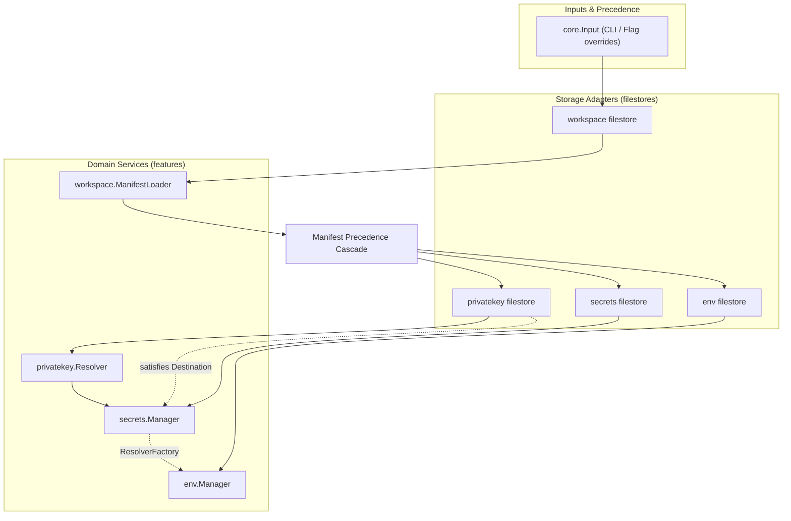
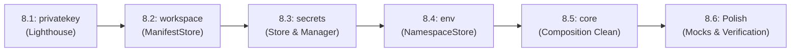

# Architecture Refactoring Plan: Dependency Injection & Consumer-Defined Repositories

This plan establishes the architecture and execution roadmap for Phase 8 of the application refactoring. It transitions feature packages from filesystem-coupled managers into true dependency-injected domain services governed by consumer-defined interfaces, with concrete persistence encapsulated into dedicated repository subpackages.

## Executive Summary & Objectives

The application layout established in Phase 6 and Phase 7 organized domain code into vertical slices under [app/internal/features](app/internal/features) and unified the composition root in [app/internal/core](app/internal/core). However, domain services and managers still mix infrastructure concerns with domain logic:
- Feature parameter structs mix domain configuration with filesystem paths (for example, `SecretsPath`, `KeysPath`, and `DefaultIndent` inside [app/internal/features/secrets/manager.go](app/internal/features/secrets/manager.go#L11-L26)).
- Domain components perform direct file discovery, atomic file writes, and YAML AST unmarshaling directly inside use cases (such as [app/internal/features/env/merge.go](app/internal/features/env/merge.go#L70-L98) and [app/internal/features/privatekey/resolver.go](app/internal/features/privatekey/resolver.go#L95-L113)).
- Unit tests often rely on temporary filesystem directories and real disk I/O when validating pure domain algorithms, slowing test runs and entangling domain testing with POSIX file behaviors.

The objective of Phase 8 is to enforce strict Dependency Injection (DI) and Clean Architecture boundaries:
1. **Consumer-Defined Interfaces**: Domain services declare the exact repository and adapter interfaces they require within the feature package root.
2. **Dedicated Repository Subpackages**: Concrete filesystem implementations live in isolated subpackages (such as a filestore subpackage) under each feature.
3. **Strict Parameter Separation**: Feature constructors take only domain dependencies (interfaces and domain values); filestore constructors take filesystem configuration (paths, permissions, indentation).
4. **Pure Composition Root**: [app/internal/core](app/internal/core) acts as the sole DI container and assembler, instantiating filestore repositories and injecting them into domain services.

## Architectural Principles & Design Patterns

### 1. Consumer-Defined Interfaces
Following Go idioms and Clean Architecture, interfaces are defined where they are consumed, not where they are implemented. A domain service defines the precise contract it requires to satisfy its use cases. The persistence implementation (e.g., local YAML, JSON, or future remote key stores) lives in a subpackage and satisfies that contract without the domain knowing its implementation details.

### 2. Parameter Segregation
Every feature that persists or reads state splits its parameters into two distinct categories:
- **`filestore.Params`**: Contains OS-level persistence parameters (file paths, discovery filenames, atomic write permissions, indent formatting).
- **`<feature>.Params`**: Contains domain-specific parameters (injected repository interfaces, cipher drivers, domain options, or environment variables).

```go
// Example: Composition Root Wiring Pattern
repository, err := filestore.New(filestore.Params{
    Path:          resolvedPath,
    DefaultIndent: 2,
})
if err != nil {
    return nil, err
}

service, err := feature.New(feature.Params{
    Repository:   repository,
    Cipher:       configuredCipher,
    ExampleParam: value,
})
```

### 3. Package Boundary Rules
- **Feature Root**: Contains domain models, domain errors, use case services, and consumer-defined repository interfaces. It has zero awareness of the concrete filestore implementation and never imports it.
- **Repository Subpackage**: Implements the repository interface using standard library file operations, atomic file helpers from [app/internal/utils/file](app/internal/utils/file), and YAML helpers. It imports domain models from its parent feature package.
- **Composition Root**: [app/internal/core](app/internal/core) imports both the feature package and its filestore subpackage, wiring them together during workspace and project resolution.
- **CLI Adapter**: Remains a presentation adapter consuming the feature root or calling through [app/internal/core](app/internal/core).

## Feature Specifications

### 1. Feature: Private Key

The private key feature is the initial lighthouse slice. It manages private key resolution across environment variables and persistent key storage.

#### Current Friction
Currently, [app/internal/features/privatekey/resolver.go](app/internal/features/privatekey/resolver.go#L36-L45) directly reads and parses the key file path, while [app/internal/features/privatekey/destinationFile.go](app/internal/features/privatekey/destinationFile.go#L11-L40) writes to it. Read and write operations against the key file are split across disconnected types.

#### Proposed Consumer Interface
Defined in the privatekey package root:
```go
package privatekey

// Repository defines persistent storage operations for private keys.
type Repository interface {
	// GetPrivateKey retrieves the stored key for a group, or reports false if absent.
	GetPrivateKey(group string) (string, bool, error)
	// SetPrivateKey persists a private key for a group.
	SetPrivateKey(group, privateKey string) error
	// Path reports the file path of the repository if backed by the filesystem.
	Path() string
}
```

#### Filestore Subpackage
Move key file parsing logic from [app/internal/features/privatekey/keyfile.go](app/internal/features/privatekey/keyfile.go) and atomic writes from [app/internal/features/privatekey/destinationFile.go](app/internal/features/privatekey/destinationFile.go) into a new filestore subpackage:
```go
package filestore

// Params configures the local filesystem key store.
type Params struct {
	Path string
}

// Store implements privatekey.Repository and privatekey.Destination for a local file.
type Store struct {
	path string
}

func New(params Params) (*Store, error)
func (s *Store) GetPrivateKey(group string) (string, bool, error)
func (s *Store) SetPrivateKey(group, privateKey string) error
func (s *Store) Path() string
func (s *Store) Write(group, privateKey string) error
```

#### Service Decoupling
Refactor [app/internal/features/privatekey/resolver.go](app/internal/features/privatekey/resolver.go):
```go
// ResolverParams configures private key resolution across env vars and repository.
type ResolverParams struct {
	// Repository provides persistent key storage. Optional; nil skips file lookup.
	Repository Repository
	// LookupEnv queries environment variables. Defaults to os.LookupEnv if nil.
	LookupEnv func(string) (string, bool)
}

func NewResolver(params ResolverParams) Resolver
```

---

### 2. Feature: Secrets

The secrets feature manages keypairs, secret encryption, store inspection, and reference resolution.

#### Current Friction
[app/internal/features/secrets/manager.go](app/internal/features/secrets/manager.go#L11-L26) accepts `SecretsPath`, `KeysPath`, and `DefaultIndent`. It directly instantiates store documents from [app/internal/features/secrets/internal/store](app/internal/features/secrets/internal/store).

#### Proposed Consumer Interface
Defined in the secrets package root:
```go
package secrets

// KeypairRecord holds public key data stored for a group.
type KeypairRecord struct {
	Group     string
	PublicKey string
}

// SecretRecord holds encrypted secret payload details.
type SecretRecord struct {
	Group      string
	Key        string
	Algorithm  string
	Ciphertext string
}

// Repository defines storage operations for secrets and keypairs.
type Repository interface {
	// Exists reports whether the underlying store exists.
	Exists() bool
	// Path returns the store file location if filesystem-backed.
	Path() string
	// Validate verifies the syntactic and structural integrity of the store.
	Validate() error

	// GetPublicKey returns the public key for a group.
	GetPublicKey(group string) (string, bool, error)
	// SetPublicKey sets or updates the public key for a group.
	SetPublicKey(group, publicKey string) error
	// ListKeypairs returns all configured keypair records.
	ListKeypairs() ([]KeypairRecord, error)

	// GetSecret retrieves an encrypted secret record.
	GetSecret(group, key string) (SecretRecord, bool, error)
	// SetSecret stores an encrypted secret record.
	SetSecret(record SecretRecord) error
	// DeleteSecret removes a secret record.
	DeleteSecret(group, key string) error
	// ListSecrets returns all stored secret records.
	ListSecrets() ([]SecretRecord, error)
}
```

#### Filestore Subpackage
Elevate and refactor [app/internal/features/secrets/internal/store](app/internal/features/secrets/internal/store) into a filestore subpackage under secrets:
```go
package filestore

// Params configures the YAML file store.
type Params struct {
	Path          string
	DefaultIndent int
}

// Store implements secrets.Repository against a YAML document.
type Store struct {
	path          string
	defaultIndent int
}

func New(params Params) (*Store, error)
```

#### Service Decoupling
Refactor [app/internal/features/secrets/manager.go](app/internal/features/secrets/manager.go):
```go
// Params configures the secrets manager with pure dependencies.
type Params struct {
	Repository            Repository
	Cipher                cipher.Cipher
	PrivateKeyResolver    privatekey.Resolver
	PrivateKeyDestination privatekey.Destination
}

func New(params Params) (*Manager, error)
```

---

### 3. Feature: Workspace

The workspace feature manages manifest discovery, strict YAML parsing, and workspace scaffolding.

#### Current Friction
[app/internal/features/workspace/loader.go](app/internal/features/workspace/loader.go#L20-L40) handles walk-up filesystem search, existence checks, and raw byte reading combined with parsing and strict schema validation.

#### Proposed Consumer Interface
Defined in the workspace package root:
```go
package workspace

// ManifestRepository abstracts manifest file location, existence, and reading.
type ManifestRepository interface {
	// Exists reports whether the manifest exists at the explicit or discovered target.
	Exists() (bool, error)
	// Discover resolves the absolute path of the manifest.
	Discover() (string, error)
	// Read loads the raw manifest bytes and detected file path.
	Read() (content []byte, path string, err error)
}
```

#### Filestore Subpackage
Create a filestore subpackage under workspace:
```go
package filestore

// ManifestParams configures filesystem manifest discovery.
type ManifestParams struct {
	Path     string
	Filename string
}

// ManifestStore implements workspace.ManifestRepository.
type ManifestStore struct {
	path     string
	filename string
}

func NewManifestStore(params ManifestParams) (*ManifestStore, error)
```

#### Service Decoupling
Refactor [app/internal/features/workspace/loader.go](app/internal/features/workspace/loader.go):
```go
// ManifestLoaderParams provides dependencies to the manifest loader.
type ManifestLoaderParams struct {
	Repository ManifestRepository
}

func NewManifestLoader(params ManifestLoaderParams) (*ManifestLoader, error)
```

---

### 4. Feature: Environment & Namespace

The environment feature executes overlay merges, flattening, and variable expression substitution.

#### Current Friction
[app/internal/features/env/merge.go](app/internal/features/env/merge.go#L70-L98) and [app/internal/features/env/load.go](app/internal/features/env/load.go#L10-L30) perform direct disk reads for base files and overlays, parsing them with YAML decoders inside the merge logic.

#### Proposed Consumer Interface
Defined in the env package root:
```go
package env

// NamespaceData holds unmarshaled key-value tree data loaded for a namespace.
type NamespaceData struct {
	Data       map[string]any
	SourcePath string
}

// NamespaceRepository loads raw namespace data for base files and overlays.
type NamespaceRepository interface {
	// LoadBase loads the base namespace tree for an include path.
	LoadBase(includePath string) (NamespaceData, error)
	// LoadOverlay loads an environment-specific overlay tree, reporting false if absent.
	LoadOverlay(includePath, env string) (NamespaceData, bool, error)
}
```

#### Filestore Subpackage
Create a filestore subpackage under env:
```go
package filestore

// Params configures namespace file loading.
type Params struct{}

// Store implements env.NamespaceRepository using local YAML and dotenv loading.
type Store struct{}

func New(params Params) *Store
```

#### Service Decoupling
Refactor [app/internal/features/env/params.go](app/internal/features/env/params.go):
```go
// Params configures the environment manager with pure domain dependencies.
type Params struct {
	Repository          NamespaceRepository
	Includes            []string
	Environments        []string
	DefaultEnvironment string
	Settings            Settings
	ResolverFactory     ValueResolverFactory
	OSEnvironment       map[string]string
}
```

---

### 5. Other Features

- **Runner**: Already adheres to clean DI. It accepts [app/internal/features/runner/params.go](app/internal/features/runner/params.go#L10-L24) containing `io.Writer` interfaces and an in-memory `Env` map. No persistence repository required.
- **Emit**: Operates on resolved in-memory entries and writes to `io.Writer`. Already decoupled from storage.
- **Pack**: Operates on the domain model `WorkspaceLayout`. It uses filesystem copy helpers to assemble isolated bundles.
- **Validate**: Operates on `WorkspaceProjects` and `secrets.Manager`. With `secrets.Manager` and `env.Manager` decoupled from persistence, validation runs against pure domain interfaces.

---

## Composition Root Architecture

[app/internal/core](app/internal/core) serves as the composition root, wiring storage adapters to domain services.



### Composition Wiring Example in [app/internal/core/composer.go](app/internal/core/composer.go)
```go
// NewSecretsManager composes the configured cipher, filestores, and domain services.
func NewSecretsManager(secretsPath, keysPath string, cipherParams cipher.Params, indent int) (*secrets.Manager, error) {
	oCipher, err := cipher.New(cipherParams)
	if err != nil {
		return nil, fmt.Errorf("creating configured cipher: %w", err)
	}

	pkStore, err := pkfilestore.New(pkfilestore.Params{Path: keysPath})
	if err != nil {
		return nil, fmt.Errorf("creating privatekey store: %w", err)
	}

	pkResolver := privatekey.NewResolver(privatekey.ResolverParams{
		Repository: pkStore,
	})

	secStore, err := secfilestore.New(secfilestore.Params{
		Path:          secretsPath,
		DefaultIndent: indent,
	})
	if err != nil {
		return nil, fmt.Errorf("creating secrets store: %w", err)
	}

	return secrets.New(secrets.Params{
		Repository:            secStore,
		Cipher:                oCipher,
		PrivateKeyResolver:    pkResolver,
		PrivateKeyDestination: pkStore,
	})
}
```

## Phased Implementation Roadmap

Every sub-phase must compile, pass formatting and lint checks (`task envx:check`), and pass all unit and integration tests (`task envx:test`).



### Phase 8.1: Private Key DI Refactoring (Lighthouse)
1. **Define repository interface**: Declare `GetPrivateKey`, `SetPrivateKey`, and `Path` in the privatekey package root.
2. **Create privatekey filestore subpackage**: Move keyfile parsing and atomic persistence into the filestore subpackage.
3. **Decouple Resolver**: Update `ResolverParams` to accept `Repository` instead of `KeysPath`.
4. **Update core and callers**: Wire the privatekey filestore in [app/internal/core/composer.go](app/internal/core/composer.go) and [app/internal/core/config.go](app/internal/core/config.go).
5. **Update tests & verify**: Update unit tests to test filestore directly and use in-memory fake repositories for `Resolver`. Run `task envx:test`.

### Phase 8.2: Workspace DI Refactoring
1. **Define workspace repository interface**: Declare `Exists`, `Discover`, and `Read` in the workspace package root.
2. **Create workspace filestore subpackage**: Implement manifest store encapsulating walk-up discovery and file I/O.
3. **Refactor ManifestLoader**: Decouple `ManifestLoader` from `file.Read` and path discovery; accept `ManifestRepository`.
4. **Wire in core**: Update [app/internal/core/config.go](app/internal/core/config.go) and [app/internal/core/composer.go](app/internal/core/composer.go) to instantiate the manifest store and inject into `ManifestLoader`.
5. **Update tests & verify**: Run `task envx:test`.

### Phase 8.3: Secrets DI Refactoring
1. **Define secrets repository interface**: Declare CRUD operations for public keys, keypairs, and secrets in the secrets package root.
2. **Elevate internal store to secrets filestore**: Convert the internal YAML store into a public filestore subpackage, implementing the secrets repository interface.
3. **Refactor secrets Params and Manager**: Remove `SecretsPath`, `KeysPath`, and `DefaultIndent` from `secrets.Params`. Inject `secrets.Repository`.
4. **Update core composition**: Update `NewSecretsManager` in [app/internal/core/composer.go](app/internal/core/composer.go) and [app/internal/core/config.go](app/internal/core/config.go) to construct the secrets filestore.
5. **Update tests & verify**: Update unit tests in secrets to mock the repository where appropriate. Run `task envx:test`.

### Phase 8.4: Environment & Namespace DI Refactoring
1. **Define env namespace repository interface**: Declare `LoadBase` and `LoadOverlay` in the env package root.
2. **Create env filestore subpackage**: Implement store handling YAML file reading, unmarshaling, and error wrapping.
3. **Refactor env Manager**: Remove direct calls to `file.Read` and `yaml.Unmarshal`. Supply `NamespaceRepository` via `env.Params`.
4. **Wire in core**: Update `ResolveProject` in [app/internal/core/config.go](app/internal/core/config.go) to construct and inject the env filestore.
5. **Update tests & verify**: Run `task envx:test`.

### Phase 8.5: Core Composition Root Streamlining
1. **Consolidate builder methods**: Review and simplify builder functions across [app/internal/core/config.go](app/internal/core/config.go), [app/internal/core/composer.go](app/internal/core/composer.go), and [app/internal/core/workspace.go](app/internal/core/workspace.go).
2. **Enforce clean lifecycle boundaries**: Ensure no store I/O occurs prematurely during workspace discovery.
3. **Verify CLI commands**: Ensure all Cobra commands under feature cli subpackages interact with cleanly assembled domain handlers.
4. **Run full verification**: Execute `task envx:check` and `task envx:test`.

### Phase 8.6: Standards Alignment & Test Fixtures Polish
1. **Harmonize test doubles**: Provide reusable in-memory fake repositories in test files for fast unit testing.
2. **Audit doc comments**: Verify that all new interfaces and constructors have complete-sentence, symbol-first doc comments.
3. **Verify E2E test suite**: Run `task envx:test:e2e` to confirm full CLI and workflow compatibility against testdata fixtures.
4. **Final clean build**: Run `task envx:all`.

## Testing Strategy

- **Unit Tests**: Use lightweight in-memory fake implementations of consumer-defined interfaces to test domain logic in isolation from disk I/O.
- **Repository Tests**: Validate real filesystem operations (atomic writes, permission modes `0600`/`0750`, YAML formatting preservation) using `t.TempDir()`.
- **Composition Tests**: Verify that [app/internal/core](app/internal/core) correctly wires real filestores to domain services and resolves manifests.
- **End-to-End Tests**: Run complete user workflows (CLI executions) against real files to ensure zero regressions across releases.
