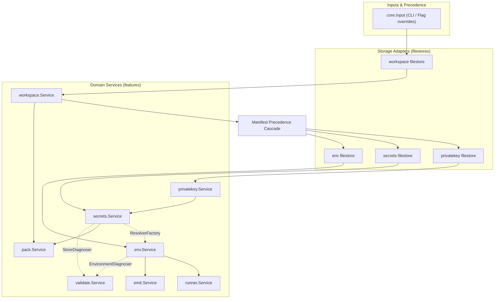

# Architecture Refactoring Plan: Dependency Injection & Consumer-Defined Repositories

This plan establishes the architecture and execution roadmap for Phase 8 of the application refactoring. It transitions feature packages from filesystem-coupled managers into true dependency-injected domain services governed by consumer-defined interfaces, with concrete persistence encapsulated into dedicated repository subpackages.

## Executive Summary & Objectives

The application layout established in Phase 6 and Phase 7 organized domain code into vertical slices under [app/internal/features](app/internal/features) and unified the composition root in [app/internal/core](app/internal/core). However, domain services and managers still mix infrastructure concerns with domain logic:
- Feature parameter structs mix domain configuration with filesystem paths (for example, `SecretsPath`, `KeysPath`, and `DefaultIndent` inside [app/internal/features/secrets/manager.go](app/internal/features/secrets/manager.go#L11-L26)).
- Domain components perform direct file discovery, atomic file writes, and YAML AST unmarshaling directly inside use cases (such as [app/internal/features/env/merge.go](app/internal/features/env/merge.go#L70-L98) and [app/internal/features/privatekey/resolver.go](app/internal/features/privatekey/resolver.go#L95-L113)).
- Unit tests often rely on temporary filesystem directories and real disk I/O when validating pure domain algorithms, slowing test runs and entangling domain testing with POSIX file behaviors.

The objective of Phase 8 is to enforce strict Dependency Injection (DI) and Clean Architecture boundaries:
1. **Consumer-Defined Interfaces**: Domain services declare the exact repository and adapter interfaces they require within the feature package root.
2. **Dedicated Repository Subpackages**: Concrete filesystem implementations live in isolated subpackages (such as a filestore subpackage) under each feature.
3. **Strict Parameter Separation**: Feature constructors take only domain dependencies (interfaces and domain values); filestore constructors take filesystem configuration (paths, permissions, indentation).
4. **Pure Composition Root**: [app/internal/core](app/internal/core) acts as the sole DI container and assembler, instantiating filestore repositories and injecting them into domain services.

## Architectural Principles & Design Patterns

### 1. Consumer-Defined Interfaces
Following Go idioms and Clean Architecture, interfaces are defined where they are consumed, not where they are implemented. A domain service defines the precise contract it requires to satisfy its use cases. The persistence implementation (e.g., local YAML, JSON, or future remote key stores) lives in a subpackage and satisfies that contract without the domain knowing its implementation details.

### 2. Parameter Segregation
Every feature that persists or reads state splits its parameters into two distinct categories:
- **`filestore.Params`**: Contains OS-level persistence parameters (file paths, discovery filenames, atomic write permissions, indent formatting).
- **`<feature>.Params`**: Contains domain-specific parameters (injected repository interfaces, cipher drivers, domain options, or environment variables).

```go
// Example: Composition Root Wiring Pattern
repository, err := filestore.New(filestore.Params{
    Path:          resolvedPath,
    DefaultIndent: 2,
})
if err != nil {
    return nil, err
}

service, err := feature.New(feature.Params{
    Repository:   repository,
    Cipher:       configuredCipher,
    ExampleParam: value,
})
```

### 3. Package Boundary Rules
- **Feature Root**: Contains domain models, domain errors, use case services, and consumer-defined repository interfaces. It has zero awareness of the concrete filestore implementation and never imports it.
- **Repository Subpackage**: Implements the repository interface using standard library file operations, atomic file helpers from [app/internal/utils/file](app/internal/utils/file), and YAML helpers. It imports domain models from its parent feature package.
- **Composition Root**: [app/internal/core](app/internal/core) imports both the feature package and its filestore subpackage, wiring them together during workspace and project resolution.
- **CLI Adapter**: Remains a presentation adapter consuming the feature root or calling through [app/internal/core](app/internal/core).

## Feature Specifications

### 1. Feature: Private Key

- **Role & Scope**: Manages transient private-key material resolution across environment variables (`ENVX_PRIVATE_KEY_<GROUP>`, `ENVX_PRIVATE_KEY`) and persistent key storage.
- **Consumer Interface**: `Repository` is defined in service.go as a consumer-defined interface specifying storage-agnostic `GetPrivateKey` and `SetPrivateKey`. It is completely storage-agnostic and free of any filesystem or destination concepts.
- **Concrete Domain Service**: The resolver is reframed as a concrete domain `Service` in service.go with `ServiceParams`. In adherence to the consumer-defined interface principle, `privatekey` exports the concrete `*Service` providing `Resolve(group string) (PrivateKey, error)` and `Set(group, privateKey string) error`, rather than defining an interface for itself. Consumers (such as `secrets`) define their own interface for the private key capabilities they require.
- **Dedicated Errors**: Sentinel errors (`ErrNotAvailable`, `ErrInvalidKey`) live in a dedicated errors file, providing a centralized and discoverable contract for error handling across callers.
- **Persistence Encapsulation**: A dedicated `filestore` subpackage encapsulates `NAME=value` parsing (from [app/internal/features/privatekey/keyfile.go](app/internal/features/privatekey/keyfile.go)) and atomic writes (from [app/internal/features/privatekey/destinationFile.go](app/internal/features/privatekey/destinationFile.go)).
- **Pure Repository Implementation**: `filestore.Store` implements `privatekey.Repository` exclusively (`GetPrivateKey` and `SetPrivateKey`). Filesystem details such as `path`, file permissions (`0600`), directory creation (`0750`), atomic writes, and gitignore protection are completely internal and private. Legacy `Destination`, `Write`, and `Path` methods are eliminated.
- **Parameter Segregation**: `filestore.Params` accepts `Path`; `privatekey.ServiceParams` accepts `Repository` and an optional `LookupEnv` function—no file paths exist in the domain service.

#### internal/features/privatekey/privatekey.go
```go
package privatekey

// PrivateKey contains transient private-key material and its lookup provenance.
type PrivateKey struct {
	Value  string
	Origin string
}
```

#### internal/features/privatekey/errors.go
```go
package privatekey

import "errors"

var (
	// ErrNotAvailable indicates that no private key is available for a group.
	ErrNotAvailable = errors.New("private key not available")
	// ErrInvalidKey indicates a present but malformed private key.
	ErrInvalidKey = errors.New("invalid private key")
)
```

#### internal/features/privatekey/service.go
```go
package privatekey

import "os"

// Repository defines persistent storage operations consumed by Service.
type Repository interface {
	// GetPrivateKey retrieves the stored key for a group, or reports false if absent.
	GetPrivateKey(group string) (string, bool, error)
	// SetPrivateKey persists a private key for a group.
	SetPrivateKey(group, privateKey string) error
}

// ServiceParams provides dependencies to the private key domain service.
type ServiceParams struct {
	// Repository provides persistent key storage. Optional; nil skips repository lookup.
	Repository Repository
	// LookupEnv queries environment variables. Defaults to os.LookupEnv if nil.
	LookupEnv func(string) (string, bool)
}

// Service coordinates private key resolution and persistence across environment variables and storage.
type Service struct {
	params ServiceParams
}

// NewService constructs a private key domain service.
func NewService(params ServiceParams) *Service {
	if params.LookupEnv == nil {
		params.LookupEnv = os.LookupEnv
	}
	return &Service{params: params}
}

// Resolve returns the first available private key for a group across env vars and repository.
func (s *Service) Resolve(group string) (PrivateKey, error)

// Set validates and persists a private key for a group via the repository.
func (s *Service) Set(group, privateKey string) error
```

#### internal/features/privatekey/filestore/store.go
```go
package filestore

// Params configures the local filesystem key store.
type Params struct {
	Path string
}

// Store implements privatekey.Repository for a local file.
type Store struct {
	path string
}

// New constructs a file-backed private key store.
func New(params Params) (*Store, error)

// GetPrivateKey retrieves a private key from the local key file.
func (s *Store) GetPrivateKey(group string) (string, bool, error)

// SetPrivateKey adds or updates a group's private key in the local file.
func (s *Store) SetPrivateKey(group, privateKey string) error
```

---

### 2. Feature: Secrets

- **Role & Scope**: Manages keypairs, secret encryption/decryption, store inspection, store auditing, and runtime reference evaluation.
- **Consumer Interface**: `secrets.Repository` defines the storage contract for reading/writing public keys and encrypted secrets. It is completely storage-agnostic, with no leaked filesystem existence or document validation methods.
- **External Dependencies Consumed**: Defines `PrivateKeyService` interface (`Resolve` and `Set`) to consume `privatekey`, and defines `CipherClient` interface (`Algorithm`, `Keypair`, `ValidateKeypair`, `Encrypt`, `Decrypt`) to consume cryptographic drivers. `secrets` has zero imports of `resources/cipher`.
- **Concrete Domain Service**: The manager is reframed as a concrete domain `Service` with `ServiceParams` storing `params ServiceParams`. Exposes use case methods: `Get`, `Set`, `Delete`, `GenerateKeypair`, `RotateKeypair`, `InspectKeypair`, `ListKeypairs`, `ListSecrets`, and reference evaluation.
- **Dedicated Errors**: Sentinel errors (`ErrKeypairExists`, `ErrGroupNotFound`, `ErrSecretNotFound`, `ErrCiphertextMismatch`, `ErrInvalidSecretKey`) live in a dedicated errors file.
- **Persistence Encapsulation**: A dedicated `filestore` subpackage elevates the existing YAML store into `filestore.Store`, implementing `secrets.Repository` using YAML AST preservation, comments, and envelope encoding.
- **Parameter Segregation**: `filestore.Params` accepts `Path` and `DefaultIndent`; `secrets.ServiceParams` accepts `Repository`, `Cipher` (as `CipherClient`), and `PrivateKeyService`—no filesystem paths exist in the domain service.

#### internal/features/secrets/secret.go
```go
package secrets

// SecretRecord holds encrypted secret payload details.
type SecretRecord struct {
	Group      string
	Key        string
	Algorithm  string
	Ciphertext string
}

// SecretReference identifies one stored secret without carrying its value.
type SecretReference struct {
	Group string
	Key   string
}

// PlaintextResolver lazily supplies one secret plaintext value.
type PlaintextResolver func() (string, error)
```

#### internal/features/secrets/keypair.go
```go
package secrets

// PrivateKeyStatus reports whether usable private-key material is available.
type PrivateKeyStatus string

const (
	PrivateKeyNotAvailable PrivateKeyStatus = "not_available"
	PrivateKeyValid        PrivateKeyStatus = "valid"
	PrivateKeyInvalid      PrivateKeyStatus = "invalid"
)

// KeypairRecord holds public key data stored for a group.
type KeypairRecord struct {
	Group     string
	PublicKey string
}

// KeypairMetadata reports public key metadata without private-key material.
type KeypairMetadata struct {
	Group            string
	PublicKey        string
	PrivateKeyStatus PrivateKeyStatus
}
```

#### internal/features/secrets/errors.go
```go
package secrets

import "errors"

var (
	// ErrGroupNotFound indicates that no public key or secret exists for a group.
	ErrGroupNotFound = errors.New("secret group not found")
	// ErrSecretNotFound indicates that a requested key does not exist in a group.
	ErrSecretNotFound = errors.New("secret key not found")
	// ErrKeypairExists indicates an existing identity prevents overwriting.
	ErrKeypairExists = errors.New("keypair already exists")
	// ErrCiphertextMismatch indicates corrupt or tampered ciphertext.
	ErrCiphertextMismatch = errors.New("ciphertext verification failed")
	// ErrInvalidSecretKey indicates a malformed secret key identifier.
	ErrInvalidSecretKey = errors.New("invalid secret key")
)
```

#### internal/features/secrets/service.go
```go
package secrets

import "github.com/go-envx/envx/app/internal/features/privatekey"

// PrivateKeyService defines the contract secrets consumes from the private key domain.
type PrivateKeyService interface {
	Resolve(group string) (privatekey.PrivateKey, error)
	Set(group, privateKey string) error
}

// CipherClient defines the cryptographic operations secrets consumes.
type CipherClient interface {
	Algorithm() string
	Keypair() (publicKey, privateKey string, err error)
	ValidateKeypair(publicKey, privateKey string) error
	Encrypt(plaintext, publicKey string) ([]byte, error)
	Decrypt(ciphertext []byte, privateKey string) (string, error)
}

// Repository defines storage operations consumed by Service.
type Repository interface {
	// GetPublicKey returns the public key for a group.
	GetPublicKey(group string) (string, bool, error)
	// SetPublicKey sets or updates the public key for a group.
	SetPublicKey(group, publicKey string) error
	// ListKeypairs returns all configured keypair records.
	ListKeypairs() ([]KeypairRecord, error)

	// GetSecret retrieves an encrypted secret record.
	GetSecret(group, key string) (SecretRecord, bool, error)
	// SetSecret stores an encrypted secret record.
	SetSecret(record SecretRecord) error
	// DeleteSecret removes a secret record.
	DeleteSecret(group, key string) error
	// ListSecrets returns all stored secret records.
	ListSecrets() ([]SecretRecord, error)
}

// ServiceParams provides dependencies to the secrets domain service.
type ServiceParams struct {
	Repository        Repository
	Cipher            CipherClient
	PrivateKeyService PrivateKeyService
}

// Service coordinates secret CRUD, keypair lifecycle, and reference evaluation.
type Service struct {
	params ServiceParams
}

// NewService constructs a secrets domain service.
func NewService(params ServiceParams) *Service {
	return &Service{params: params}
}

// Get resolves and decrypts one stored secret for a group and key.
func (s *Service) Get(group, key string) (string, error)

// Set encrypts and persists one secret for a group and key.
func (s *Service) Set(group, key string, source PlaintextResolver) error

// Delete removes one stored secret for a group and key.
func (s *Service) Delete(group, key string) error

// GenerateKeypair generates a new keypair, stores the private key, and commits the public key.
func (s *Service) GenerateKeypair(group string) (KeypairMetadata, error)

// RotateKeypair re-encrypts stored secrets with a new keypair and commits changes.
func (s *Service) RotateKeypair(group string) (KeypairMetadata, error)

// InspectKeypair reports safe status for a group's stored keypair.
func (s *Service) InspectKeypair(group string) (KeypairMetadata, error)
```

#### internal/features/secrets/filestore/store.go
```go
package filestore

import "github.com/go-envx/envx/app/internal/features/secrets"

// Params configures the YAML file store.
type Params struct {
	Path          string
	DefaultIndent int
}

// Store implements secrets.Repository against a YAML document.
type Store struct {
	path          string
	defaultIndent int
}

// New constructs a file-backed secrets repository.
func New(params Params) (*Store, error)

// GetPublicKey satisfies secrets.Repository.
func (s *Store) GetPublicKey(group string) (string, bool, error)

// SetPublicKey satisfies secrets.Repository.
func (s *Store) SetPublicKey(group, publicKey string) error

// ListKeypairs satisfies secrets.Repository.
func (s *Store) ListKeypairs() ([]secrets.KeypairRecord, error)

// GetSecret satisfies secrets.Repository.
func (s *Store) GetSecret(group, key string) (secrets.SecretRecord, bool, error)

// SetSecret satisfies secrets.Repository.
func (s *Store) SetSecret(record secrets.SecretRecord) error

// DeleteSecret satisfies secrets.Repository.
func (s *Store) DeleteSecret(group, key string) error

// ListSecrets satisfies secrets.Repository.
func (s *Store) ListSecrets() ([]secrets.SecretRecord, error)
```

---

### 3. Feature: Workspace

- **Role & Scope**: Workspace configuration loading, environment declarations, project definitions, and settings precedence cascade.
- **Pure Domain Entity**: The central domain entity is `Workspace` in workspace.go. It represents the validated workspace model (environments, projects, settings, secrets config, and validation severities) along with its root directory and config path. It has **zero YAML tags** and zero imports of serialization libraries.
- **Consumer Interface**: `Repository` is defined in service.go as a consumer-defined persistence contract for loading the validated workspace domain entity. Discovery and existence checks are internal implementation details of the repository and are not leaked into the interface.
- **Concrete Domain Service**: The loader is reframed as a concrete domain `Service` in service.go with `ServiceParams` storing `params ServiceParams`. Exposes a single focused use case method: `Load() (*Workspace, error)`.
- **Dedicated Errors**: Sentinel errors (`ErrNotFound`, `ErrProjectNotFound`, `ErrEnvironmentNotFound`) live in a dedicated errors file.
- **Persistence Encapsulation**: A dedicated `filestore` subpackage (`filestore.Store`) implements `workspace.Repository`. It privately handles directory walk-up discovery, file reading, YAML parsing with strict unknown-field detection, detected indentation, and mapping into the pure domain `Workspace` entity.
- **Parameter Segregation**: `filestore.Params` accepts `Path` and `Filename`; `workspace.ServiceParams` accepts `Repository`—zero filesystem search logic or YAML decoding exists in the domain service.

#### internal/features/workspace/workspace.go
```go
package workspace

// Settings holds global and project-level workspace resolution options.
type Settings struct {
	RequireOverlays  bool
	Prefix           string
	Suffix           string
	Delimiter        string
	Overload         bool
	ReferencePattern string
}

// Project defines one project's environment configuration within a workspace.
type Project struct {
	Includes []string
}

// SecretsConfig configures the workspace-level secrets store.
type SecretsConfig struct {
	SecretsPath string
	KeysPath    string
	Cipher      string
}

// Workspace represents the validated workspace domain entity.
type Workspace struct {
	Path               string
	Root               string
	Indent             int
	Environments       []string
	Projects           map[string]Project
	Settings           Settings
	Secrets            SecretsConfig
	ValidateSeverities map[string]string
}

// DefaultEnvironment returns the first declared environment, or an empty string.
func (w *Workspace) DefaultEnvironment() string

// HasEnvironment reports whether env is declared in the workspace.
func (w *Workspace) HasEnvironment(env string) bool

// HasInclude reports whether any project declares includePath in its includes.
func (w *Workspace) HasInclude(includePath string) bool

// LookupProject finds a project by name, returning its definition and whether it was found.
func (w *Workspace) LookupProject(name string) (Project, bool)
```

#### internal/features/workspace/errors.go
```go
package workspace

import "errors"

var (
	// ErrNotFound indicates that no workspace configuration could be located.
	ErrNotFound = errors.New("workspace not found")
	// ErrProjectNotFound indicates that a requested project is not declared.
	ErrProjectNotFound = errors.New("project not declared in workspace")
	// ErrEnvironmentNotFound indicates an undeclared target environment.
	ErrEnvironmentNotFound = errors.New("environment not declared in workspace")
)
```

#### internal/features/workspace/service.go
```go
package workspace

// Repository abstracts workspace persistence operations consumed by Service.
type Repository interface {
	// Load discovers, reads, parses, and validates the workspace configuration.
	Load() (*Workspace, error)
}

// ServiceParams provides dependencies to the workspace domain service.
type ServiceParams struct {
	Repository Repository
}

// Service coordinates workspace loading.
type Service struct {
	params ServiceParams
}

// NewService constructs a workspace domain service.
func NewService(params ServiceParams) *Service {
	return &Service{params: params}
}

// Load retrieves and validates the workspace domain entity from the repository.
func (s *Service) Load() (*Workspace, error) {
	return s.params.Repository.Load()
}
```

#### internal/features/workspace/filestore/store.go
```go
package filestore

import (
	"github.com/go-envx/envx/app/internal/features/workspace"
)

// Params configures filesystem workspace discovery.
type Params struct {
	Path     string
	Filename string
}

// Store implements workspace.Repository for the local filesystem using YAML decoding.
type Store struct {
	path     string
	filename string
}

// New constructs a file-backed workspace repository.
func New(params Params) (*Store, error)

// Load reads the workspace file, applies strict YAML decoding, and returns the domain entity.
func (s *Store) Load() (*workspace.Workspace, error)
```

---

### 4. Feature: Workspace Scaffolding (Scaffold)

- **Role & Scope**: Scaffolds starter workspaces (`quick-start`) into a target directory from embedded templates with conflict checking.
- **Independence from Workspace Repository**: Completely decoupled from `workspace.Repository` and `workspace.Service`; does not require an existing workspace on disk.
- **Concrete Domain Service**: The scaffolding engine is framed as a concrete domain `Service` in service.go with `ServiceParams` storing `params ServiceParams`. Exposes `Create(cmd Command) (Result, error)`.
- **Dedicated Errors**: Sentinel errors (`ErrTemplateNotFound`, `ErrConflict`) live in a dedicated errors file.
- **Parameter Segregation**: File conflict policy and destination directory are supplied per `Create` invocation via `Command`.

#### internal/features/scaffold/scaffold.go
```go
package scaffold

// Command defines input parameters for scaffolding a workspace template.
type Command struct {
	Template  string
	TargetDir string
	Force     bool
}

// Result represents the outcome of scaffolding a workspace template.
type Result struct {
	Written []string
}
```

#### internal/features/scaffold/errors.go
```go
package scaffold

import "errors"

var (
	// ErrTemplateNotFound indicates that an unknown starter template was requested.
	ErrTemplateNotFound = errors.New("template not found")
	// ErrConflict indicates existing files conflict with template scaffolding.
	ErrConflict = errors.New("target directory contains conflicting files (use --force to overwrite)")
)
```

#### internal/features/scaffold/service.go
```go
package scaffold

import "io/fs"

// ServiceParams provides template filesystem dependencies to the scaffolding service.
type ServiceParams struct {
	// Source provides template files (defaults to embedded templates if nil).
	Source fs.FS
}

// Service coordinates template extraction, conflict checks, and filesystem writes.
type Service struct {
	params ServiceParams
}

// NewService constructs a workspace scaffolding domain service.
func NewService(params ServiceParams) *Service {
	return &Service{params: params}
}

// Create scaffolds a template into the target directory with conflict checks.
func (s *Service) Create(cmd Command) (Result, error)
```

---

### 5. Feature: Environment & Namespace

- **Role & Scope**: Multi-layer environment variable synthesis, namespace file overlay merging, key canonicalization, variable expression substitution via the syntax subpackage, and OS overload policies.
- **Consumer Interface**: `NamespaceRepository`, `ValueResolver`, and `ValueResolverFactory` are defined in service.go as consumer-defined interfaces required by `Service`.
- **Concrete Domain Service**: The manager is reframed as a concrete domain `Service` with `ServiceParams` storing `params ServiceParams`. Exposes use case methods: `Materialize`, `Get`, `Set`, `Explain`, and `Diff`.
- **Dedicated Errors**: Sentinel errors (`ErrEnvironmentNotDeclared`, `ErrOverlayNotFound`, `ErrFlattenCollision`, `ErrCircularReference`) live in a dedicated errors file.
- **Persistence Encapsulation**: A dedicated `filestore` subpackage (`filestore.Store`) implements `env.NamespaceRepository`, reading and unmarshaling YAML/dotenv files.
- **Parameter Segregation**: `filestore.Params` configures filesystem loading; `env.ServiceParams` takes `Repository`, `Includes`, `Environments`, `DefaultEnvironment`, `Settings`, `ResolverFactory`, and `OSEnvironment`—zero direct file I/O or YAML decoding in the domain service.

#### internal/features/env/variable.go
```go
package env

// Origin records the provenance of a resolved environment variable.
type Origin struct {
	Source   string
	Shadowed []string
}

// Variable represents one synthesized environment variable with provenance.
type Variable struct {
	Key    string
	Value  string
	Origin Origin
}

// Settings holds environment-resolution tuning options.
type Settings struct {
	RequireOverlays  bool
	Prefix           string
	Suffix           string
	Delimiter        string
	Overload         bool
	ReferencePattern string
}
```

#### internal/features/env/errors.go
```go
package env

import "errors"

var (
	// ErrEnvironmentNotDeclared indicates that a requested environment is not declared.
	ErrEnvironmentNotDeclared = errors.New("environment not declared")
	// ErrOverlayNotFound indicates a required environment overlay file is missing.
	ErrOverlayNotFound = errors.New("required overlay file not found")
	// ErrFlattenCollision indicates two distinct object keys flatten to the same variable name.
	ErrFlattenCollision = errors.New("flatten collision detected")
	// ErrCircularReference indicates variable substitution encountered a dependency cycle.
	ErrCircularReference = errors.New("circular variable reference detected")
)
```

#### internal/features/env/service.go
```go
package env

import "github.com/go-envx/envx/app/internal/features/env/syntax"

// NamespaceData holds unmarshaled key-value tree data loaded for a namespace.
type NamespaceData struct {
	Data       map[string]any
	SourcePath string
}

// NamespaceRepository loads raw namespace data consumed by Service.
type NamespaceRepository interface {
	// LoadBase loads the base namespace tree for an include path.
	LoadBase(includePath string) (NamespaceData, error)
	// LoadOverlay loads an environment-specific overlay tree, reporting false if absent.
	LoadOverlay(includePath, env string) (NamespaceData, bool, error)
}

// ValueResolver dereferences one winning scalar value and returns unrecognized values unchanged.
type ValueResolver interface {
	Resolve(value, env string) (string, error)
}

// ValueResolverFactory opens a fresh, operation-scoped value resolver under the requested reveal policy.
type ValueResolverFactory interface {
	Resolver(reveal bool) (ValueResolver, error)
}

// ServiceParams provides dependencies to the environment domain service.
type ServiceParams struct {
	Repository          NamespaceRepository
	Includes            []string
	Environments        []string
	DefaultEnvironment string
	Settings            Settings
	ResolverFactory     ValueResolverFactory
	OSEnvironment       map[string]string
}

// Service coordinates overlay merging, key canonicalization, and variable substitution.
type Service struct {
	params  ServiceParams
	grammar *syntax.Grammar
}

// NewService constructs an environment domain service.
func NewService(params ServiceParams) (*Service, error)

// Materialize compiles the effective key-value environment for an environment.
func (s *Service) Materialize(environment string) (map[string]string, error)

// Get retrieves a single key's effective value and provenance.
func (s *Service) Get(key, environment string) (Variable, error)

// Explain generates full provenance trees and variable dependency graphs.
func (s *Service) Explain(environment string, reveal bool) (ExplainResult, error)

// Diff computes environment deltas between two declared environments.
func (s *Service) Diff(envA, envB string) (DiffResult, error)
```

#### internal/features/env/filestore/store.go
```go
package filestore

import "github.com/go-envx/envx/app/internal/features/env"

// Params configures namespace file loading.
type Params struct{}

// Store implements env.NamespaceRepository using local YAML and dotenv loading.
type Store struct{}

// New constructs a file-backed namespace repository.
func New(params Params) *Store {
	return &Store{}
}

// LoadBase satisfies env.NamespaceRepository.
func (s *Store) LoadBase(includePath string) (env.NamespaceData, error)

// LoadOverlay satisfies env.NamespaceRepository.
func (s *Store) LoadOverlay(includePath, env string) (env.NamespaceData, bool, error)
```

---

### 6. Feature: Process Execution (Runner)

- **Role & Scope**: Subprocess supervisor executing child processes with injected materialized environments, transparent POSIX signal forwarding, and exit code mirroring.
- **Consumer Interface**: Operates on injected process streams (`io.Writer`, `io.Reader`). Does not require a persistence repository.
- **Concrete Domain Service**: The execution runner is framed as a concrete domain `Service` with `ServiceParams` storing `params ServiceParams`. Exposes `Run(cmd Command) error`.
- **Dedicated Errors**: Sentinel errors (`ErrNoCommandSpecified`, `ErrProcessStartFailed`) live in a dedicated errors file.
- **Parameter Segregation**: Standard streams (`Stdout`, `Stderr`, `Stdin`) are injected via `ServiceParams`, defaulting to OS streams when nil. Command arguments and environment maps are provided per `Run` invocation via `Command`.

#### internal/features/runner/process.go
```go
package runner

// Command specifies the child command to spawn and its injected environment.
type Command struct {
	Args []string
	Env  map[string]string
}
```

#### internal/features/runner/errors.go
```go
package runner

import "errors"

var (
	// ErrNoCommandSpecified indicates that an empty command slice was passed to Run.
	ErrNoCommandSpecified = errors.New("no command specified")
	// ErrProcessStartFailed indicates that the child executable could not be spawned.
	ErrProcessStartFailed = errors.New("failed to start process")
)
```

#### internal/features/runner/service.go
```go
package runner

import (
	"io"
	"os"
)

// ServiceParams provides stream dependencies to the process execution service.
type ServiceParams struct {
	Stdout io.Writer
	Stderr io.Writer
	Stdin  io.Reader
}

// Service supervises child process lifecycle, signal propagation, and exit status.
type Service struct {
	params ServiceParams
}

// NewService constructs a process execution domain service.
func NewService(params ServiceParams) *Service {
	if params.Stdout == nil {
		params.Stdout = os.Stdout
	}
	if params.Stderr == nil {
		params.Stderr = os.Stderr
	}
	if params.Stdin == nil {
		params.Stdin = os.Stdin
	}
	return &Service{params: params}
}

// Run executes the command with injected environment and relays received signals.
func (s *Service) Run(cmd Command) error
```

---

### 7. Feature: Target Serialization (Emit)

- **Role & Scope**: Serializes resolved environment key-value pairs into target deployment formats: plain dotenv, flat JSON, or Kubernetes resources (splitting sensitive keys into Kubernetes Secret and non-sensitive into ConfigMap, or unified bundle).
- **Consumer Interface**: Does not require a repository. Operates on in-memory entries and serializes directly to any destination `io.Writer`.
- **Concrete Domain Service**: The emit engine is framed as a concrete domain `Service` with `ServiceParams` storing `params ServiceParams`. Exposes `Render(cmd Command) error` to avoid method stutter (`emit.Emit`).
- **Dedicated Errors**: Sentinel errors (`ErrUnknownTarget`, `ErrMissingNameBase`, `ErrNoEntries`) live in a dedicated errors file.
- **Parameter Segregation**: Output formats, entry slices, and writer streams are supplied in `Command` at execution time.

#### internal/features/emit/target.go
```go
package emit

import "io"

// Target identifies the output serialization target.
type Target string

const (
	TargetK8s       Target = "k8s"
	TargetK8sBundle Target = "k8s-bundle"
	TargetJSON      Target = "json"
	TargetDotenv    Target = "dotenv"
)

// Entry is one resolved environment variable to render.
type Entry struct {
	Key    string
	Value  string
	Secret bool
}

// Command configures a single serialization request.
type Command struct {
	Target         Target
	Entries        []Entry
	Writer         io.Writer
	NameBase       string
	ExactName      bool
	IncludeSecrets bool
	IncludeConfig  bool
}
```

#### internal/features/emit/errors.go
```go
package emit

import "errors"

var (
	// ErrUnknownTarget indicates that an unsupported serialization target was requested.
	ErrUnknownTarget = errors.New("unknown emit target")
	// ErrMissingNameBase indicates that a Kubernetes target lacks a resource name base.
	ErrMissingNameBase = errors.New("kubernetes target requires a name base")
	// ErrNoEntries indicates that the entries slice was empty.
	ErrNoEntries = errors.New("no entries provided for serialization")
)
```

#### internal/features/emit/service.go
```go
package emit

// ServiceParams configures default serialization parameters.
type ServiceParams struct{}

// Service handles rendering materialized environments into target formats.
type Service struct {
	params ServiceParams
}

// NewService constructs an emit domain service.
func NewService(params ServiceParams) *Service {
	return &Service{params: params}
}

// Render renders the requested environment entries to the target writer.
func (s *Service) Render(cmd Command) error
```

---

### 8. Feature: Deployment Bundling (Pack)

- **Role & Scope**: Constructs isolated, self-contained deployment packages for container images. Rewrites manifest include paths to per-project directories, filters secret stores to referenced secrets, copies environment overlays, and strips private keys.
- **Consumer Interface**: Operates on domain models (`WorkspaceLayout`). Does not require an abstract repository; utilizes filesystem copy and YAML rewriting utilities.
- **Concrete Domain Service**: The packaging engine is framed as a concrete domain `Service` with `ServiceParams` storing `params ServiceParams`. Exposes `Pack(cmd PackCommand) (PackResult, error)`.
- **Dedicated Errors**: Sentinel errors (`ErrOutputNotEmpty`, `ErrEnvironmentNotDeclared`, `ErrProjectNotFound`) live in a dedicated errors file.
- **Parameter Segregation**: Output directory path, overwrite flags, and project selections are supplied via `PackCommand`.

#### internal/features/pack/bundle.go
```go
package pack

// Project specifies one project's include declarations.
type Project struct {
	Name     string
	Includes []string
}

// WorkspaceLayout provides the file-level view pack reads from.
type WorkspaceLayout struct {
	ManifestPath string
	Root         string
	SecretsPath  string
	Environments []string
	Projects     []Project
}

// PackCommand configures a bundle generation request.
type PackCommand struct {
	Workspace    WorkspaceLayout
	Environments []string
	Projects     []string
	OutDir       string
	Force        bool
}

// PackResult summarizes the files and metadata written to the bundle.
type PackResult struct {
	OutDir       string
	ManifestFile string
	Files        []string
	Environments []string
	Projects     []string
}
```

#### internal/features/pack/errors.go
```go
package pack

import "errors"

var (
	// ErrOutputNotEmpty indicates that the destination directory exists and is not empty.
	ErrOutputNotEmpty = errors.New("output directory is not empty (use --force to overwrite)")
	// ErrEnvironmentNotDeclared indicates that an unknown environment was requested.
	ErrEnvironmentNotDeclared = errors.New("environment not declared in workspace")
	// ErrProjectNotFound indicates that an unknown project was requested.
	ErrProjectNotFound = errors.New("project not declared in workspace")
)
```

#### internal/features/pack/service.go
```go
package pack

// ServiceParams configures default bundle options.
type ServiceParams struct{}

// Service coordinates file discovery, store filtering, path rewriting, and packaging.
type Service struct {
	params ServiceParams
}

// NewService constructs a pack domain service.
func NewService(params ServiceParams) *Service {
	return &Service{params: params}
}

// Pack constructs an isolated deployment bundle in the specified directory.
func (s *Service) Pack(cmd PackCommand) (PackResult, error)
```

---

### 9. Feature: Workspace Diagnostics (Validate)

- **Role & Scope**: Static analysis and health checks across two check boundaries (offline store checks: unencrypted secrets, key availability, algorithm mismatch; and resolution checks: missing references, circular references, undeclared base properties).
- **Consumer Interfaces**: `EnvironmentDiagnoser` and `StoreDiagnoser` are defined in service.go as consumer-defined interfaces required by `Service`. `validate` does not depend on concrete environment or secrets services.
- **Concrete Domain Service**: The validation engine is framed as a concrete domain `Service` in service.go with `ServiceParams` storing `params ServiceParams`. Exposes `Validate(workspace WorkspaceDiagnostics, options ValidateOptions) (Report, error)`.
- **Dedicated Errors**: Sentinel errors (`ErrNoChecksSelected`, `ErrRegistryEmpty`) live in a dedicated errors file.
- **Parameter Segregation**: Rule registry is injected in `ServiceParams`; workspace models and filtering options are supplied to `Validate`.

#### internal/features/validate/check.go
```go
package validate

import "github.com/go-envx/envx/app/internal/shared/status"

// Finding records one diagnostic issue detected during validation.
type Finding struct {
	Code     string
	Message  string
	Severity status.Severity
	Location string
}

// Report holds the graded collection of validation findings.
type Report struct {
	Findings []Finding
	Passed   bool
}

// ValidateOptions controls which check groups and severity escalations apply.
type ValidateOptions struct {
	Strict   bool
	Checks   map[string]bool
	Severity map[string]status.Severity
}
```

#### internal/features/validate/errors.go
```go
package validate

import "errors"

var (
	// ErrNoChecksSelected indicates that selection flags excluded all check rules.
	ErrNoChecksSelected = errors.New("no validation checks selected")
	// ErrRegistryEmpty indicates that the validation check registry is unpopulated.
	ErrRegistryEmpty = errors.New("validation check registry is empty")
)
```

#### internal/features/validate/service.go
```go
package validate

import (
	"github.com/go-envx/envx/app/internal/features/env"
	"github.com/go-envx/envx/app/internal/features/secrets"
)

// EnvironmentDiagnoser defines what validate needs from environment resolution.
type EnvironmentDiagnoser interface {
	Explain(environment string, reveal bool) (env.ExplainResult, error)
}

// StoreDiagnoser defines what validate needs from secrets storage inspection.
type StoreDiagnoser interface {
	StoredSecrets() ([]secrets.SecretReference, error)
	Keypairs() ([]secrets.KeypairMetadata, error)
}

// ProjectEnvironment pairs a project name with its environment diagnoser.
type ProjectEnvironment struct {
	Name      string
	Diagnoser EnvironmentDiagnoser
}

// WorkspaceDiagnostics bundles the inputs required for full workspace validation.
type WorkspaceDiagnostics struct {
	Projects     []ProjectEnvironment
	Environments []string
	Store        StoreDiagnoser
}

// ServiceParams provides check registry dependencies to the validate domain service.
type ServiceParams struct {
	Registry *Registry
}

// Service coordinates store and resolution diagnostic scans across a workspace.
type Service struct {
	params ServiceParams
}

// NewService constructs a validation domain service.
func NewService(params ServiceParams) *Service {
	return &Service{params: params}
}

// Validate evaluates registered check rules against the workspace diagnostics view.
func (s *Service) Validate(w WorkspaceDiagnostics, options ValidateOptions) (Report, error)
```

---

## Composition Root Architecture

[app/internal/core](app/internal/core) serves as the composition root, wiring storage adapters to domain services.



### Composition Wiring Example in [app/internal/core/composer.go](app/internal/core/composer.go)
```go
// NewSecretsService composes the configured cipher, filestores, and domain services.
func NewSecretsService(secretsPath, keysPath string, cipherParams cipher.Params, indent int) (*secrets.Service, error) {
	oCipher, err := cipher.New(cipherParams)
	if err != nil {
		return nil, fmt.Errorf("creating configured cipher: %w", err)
	}

	pkStore, err := pkfilestore.New(pkfilestore.Params{Path: keysPath})
	if err != nil {
		return nil, fmt.Errorf("creating privatekey store: %w", err)
	}

	pkService := privatekey.NewService(privatekey.ServiceParams{
		Repository: pkStore,
	})

	secStore, err := secfilestore.New(secfilestore.Params{
		Path:          secretsPath,
		DefaultIndent: indent,
	})
	if err != nil {
		return nil, fmt.Errorf("creating secrets store: %w", err)
	}

	return secrets.NewService(secrets.ServiceParams{
		Repository:        secStore,
		Cipher:            oCipher,
		PrivateKeyService: pkService,
	})
}
```

## Phased Implementation Roadmap

Every sub-phase must compile, pass formatting and lint checks (`task envx:check`), and pass all unit and integration tests (`task envx:test`).

```mermaid
flowchart LR
    Sub81["8.1: privatekey<br/>(Lighthouse)"] --> Sub82["8.2: workspace & scaffold<br/>(Workspace & Scaffolder)"]
    Sub82 --> Sub83["8.3: secrets<br/>(Store & Service)"]
    Sub83 --> Sub84["8.4: env<br/>(NamespaceStore)"]
    Sub84 --> Sub85["8.5: runner & emit<br/>(Pure Services)"]
    Sub85 --> Sub86["8.6: pack & validate<br/>(Bundling & Checks)"]
    Sub86 --> Sub87["8.7: core<br/>(Composition Clean)"]
    Sub87 --> Sub88["8.8: Polish<br/>(Mocks & Verification)"]
```



### Phase 8.1: Private Key DI Refactoring (Lighthouse)
1. **Define repository and errors**: Declare storage-agnostic `GetPrivateKey` and `SetPrivateKey` in the repository contract and extract sentinel errors into a dedicated errors file.
2. **Create privatekey filestore subpackage**: Move keyfile parsing and atomic persistence into the filestore subpackage, implementing `privatekey.Repository` with private filesystem configuration.
3. **Reframe Resolver as Service**: Refactor the resolver into a concrete domain service `*Service` providing both `Resolve` and `Set` operations via `ServiceParams`.
4. **Update core and callers**: Wire `pkfilestore.New` and `privatekey.NewService` in [app/internal/core/composer.go](app/internal/core/composer.go) and [app/internal/core/config.go](app/internal/core/config.go).
5. **Update tests & verify**: Update unit tests to test `filestore` directly and use in-memory fake repositories for `Service`. Run `task envx:test`.

### Phase 8.2: Workspace & Scaffold DI Refactoring
1. **Consolidate domain entity**: Define pure `workspace.Workspace` in workspace.go with zero YAML tags, replacing `Manifest`, `ManifestDoc`, and `Document`.
2. **Define repository and service**: Declare `Load` in `workspace.Repository` within service.go, internalizing discovery and existence checks into `filestore.Store`.
3. **Create workspace filestore subpackage**: Implement `filestore.Store` encapsulating walk-up discovery, file reading, strict YAML decoding, and indentation detection.
4. **Extract scaffold feature**: Extract workspace template creation into a dedicated `features/scaffold` package (`scaffold.Service`, `Command`, `Result`), decoupling template extraction from runtime workspace configuration.
5. **Wire in core and CLI**: Update [app/internal/core/config.go](app/internal/core/config.go) and [app/internal/core/composer.go](app/internal/core/composer.go) to wire `workspace.Service`, and wire `scaffold.Service` into the `envx create` CLI command.
6. **Update tests & verify**: Run `task envx:test`.

### Phase 8.3: Secrets DI Refactoring
1. **Define secrets repository interface**: Declare CRUD operations for public keys, keypairs, and secrets in the secrets package root, omitting filesystem existence and document validation.
2. **Elevate internal store to secrets filestore**: Convert the internal YAML store into a public filestore subpackage, implementing the secrets repository interface.
3. **Refactor secrets Service**: Reframe manager into `secrets.Service` accepting `secrets.Repository`, `CipherClient`, and `PrivateKeyService`. Remove file paths from domain params.
4. **Update core composition**: Update `NewSecretsService` in [app/internal/core/composer.go](app/internal/core/composer.go) and [app/internal/core/config.go](app/internal/core/config.go) to construct the secrets filestore.
5. **Update tests & verify**: Update unit tests in secrets to mock the repository where appropriate. Run `task envx:test`.

### Phase 8.4: Environment & Namespace DI Refactoring
1. **Define env namespace repository interface**: Declare `LoadBase` and `LoadOverlay` in the env package root.
2. **Create env filestore subpackage**: Implement store handling YAML file reading, unmarshaling, and error wrapping.
3. **Refactor env Service**: Reframe manager into `env.Service`. Remove direct calls to `file.Read` and `yaml.Unmarshal`. Supply `NamespaceRepository` via `env.ServiceParams`.
4. **Wire in core**: Update `ResolveProject` in [app/internal/core/config.go](app/internal/core/config.go) to construct and inject the env filestore.
5. **Update tests & verify**: Run `task envx:test`.

### Phase 8.5: Process Execution & Serialization DI Refactoring (`runner` & `emit`)
1. **Refactor runner Service**: Encapsulate process supervision and stream injection in `runner.Service` with `ServiceParams`.
2. **Refactor emit Service**: Encapsulate target serialization in `emit.Service` with `ServiceParams`.
3. **Update CLI callers**: Wire `runner.Service` and `emit.Service` into their presentation CLI adapters.
4. **Update tests & verify**: Run `task envx:test`.

### Phase 8.6: Bundling & Diagnostics DI Refactoring (`pack` & `validate`)
1. **Refactor pack Service**: Encapsulate workspace layout bundling, path rewriting, and store filtering into `pack.Service`.
2. **Refactor validate Service & Consumer Interfaces**: Define `EnvironmentDiagnoser` and `StoreDiagnoser` interfaces in `validate`, decoupling it from concrete services.
3. **Update CLI callers**: Wire `pack.Service` and `validate.Service` into their presentation CLI adapters.
4. **Update tests & verify**: Run `task envx:test`.

### Phase 8.7: Core Composition Root Streamlining
1. **Consolidate builder methods**: Review and simplify builder functions across [app/internal/core/config.go](app/internal/core/config.go), [app/internal/core/composer.go](app/internal/core/composer.go), and [app/internal/core/workspace.go](app/internal/core/workspace.go).
2. **Enforce clean lifecycle boundaries**: Ensure no store I/O occurs prematurely during workspace discovery.
3. **Verify CLI commands**: Ensure all Cobra commands under feature cli subpackages interact with cleanly assembled domain services.
4. **Run full verification**: Execute `task envx:check` and `task envx:test`.

### Phase 8.8: Standards Alignment & Test Fixtures Polish
1. **Harmonize test doubles**: Provide reusable in-memory fake repositories in test files for fast unit testing.
2. **Audit doc comments**: Verify that all new interfaces and constructors have complete-sentence, symbol-first doc comments.
3. **Verify E2E test suite**: Run `task envx:test:e2e` to confirm full CLI and workflow compatibility against testdata fixtures.
4. **Final clean build**: Run `task envx:all`.

## Testing Strategy

- **Unit Tests**: Use lightweight in-memory fake implementations of consumer-defined interfaces to test domain logic in isolation from disk I/O.
- **Repository Tests**: Validate real filesystem operations (atomic writes, permission modes `0600`/`0750`, YAML formatting preservation) using `t.TempDir()`.
- **Composition Tests**: Verify that [app/internal/core](app/internal/core) correctly wires real filestores to domain services and resolves manifests.
- **End-to-End Tests**: Run complete user workflows (CLI executions) against real files to ensure zero regressions across releases.
