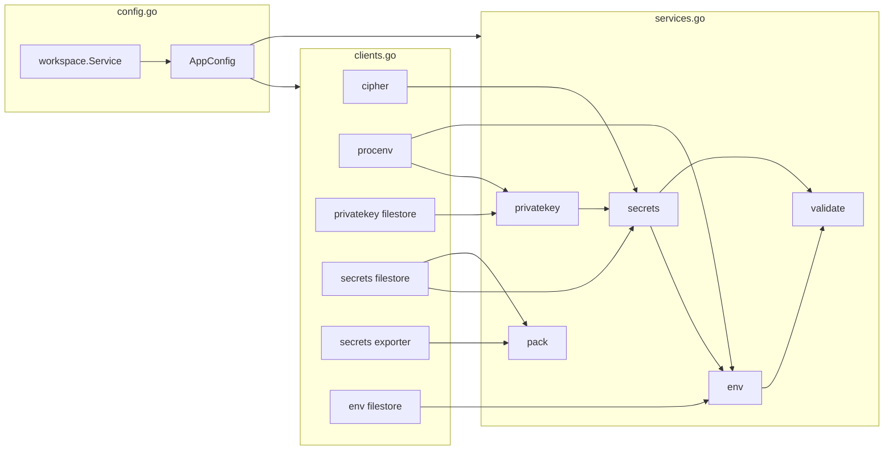
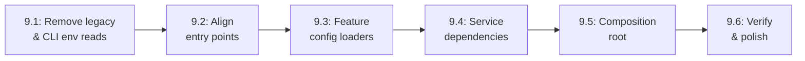

# Architecture Plan: Composition Root & Service Dependencies

This plan defines Phase 9, which supersedes Phases 8.8 and 8.9 of [20260924-di-refactor.md](20260924-di-refactor.md). Phase 8 gave every feature a consumer-defined repository and a domain service. Phase 9 finishes the dependency-injection work by turning [app/internal/core](app/internal/core) into a pure composition root and by making every client, service, and config slice follow one entry-point pattern.

## Objectives

1. **`core` contains zero application logic.** It reads like a table of contents: it loads config, constructs clients, constructs services, and hands them out through an `AppFactory`. No loops, no defaults, no precedence rules, no sorting, no `os` access.
2. **Services declare the services they depend on.** A service that needs another service's behavior accepts it through a consumer-defined interface in its `ServiceParams`. A dependency is registered only when the service truly calls it.
3. **One pattern for config, clients, and services.** A developer opening any client or service package finds the same entry point in the same file with the same shape, and can reason about the package from that entry point alone.
4. **CLI-only concerns stay in the CLI.** `ENVX_*` setting fallbacks are resolved by `flags.Spec.GetOpt` at the CLI edge. Domain services and `core` never read process environment variables for configuration.

## Current State Review

### Dead or legacy code in `core`

| Symbol | Status |
|---|---|
| `Input`, `GetInput` in [deprecated.go](../app/internal/core/deprecated.go) | Test-only. CLI commands pass `env.Options` per operation. |
| `ResolveProject`, `ResolveWorkspace`, `resolve`, `resolveManifest`, `resolveProjectLayer`, `resolveEnvmergeParams`, `manifestContext`, `projectLayer` in [config.go](../app/internal/core/config.go) | Test-only, except `ResolveWorkspace`, which the `App` methods use internally. |
| `Result`, `OverlayPath` in [result.go](../app/internal/core/result.go) | Superseded by `env.NamespaceRepository.SetOverlay`. |
| `NewConfiguredCipher`, `NewEnvService`, `NewSecretsManager` (a duplicate of `NewSecretsService`) in [composer.go](../app/internal/core/composer.go) | Test-only. |
| `ResolveWorkspaceLayout`, `WorkspaceLayout`, `ProjectIncludes` in [workspace.go](../app/internal/core/workspace.go), and `workspace.Layout`, `workspace.ProjectRef` | Only feed `NewPackService`. |
| `env.Service.SetDefaultProject`, `env.ServiceParams.DefaultProject`, `env.ServiceParams.Includes`, [env/deprecated.go](../app/internal/features/env/deprecated.go) | Only set by `ResolveProject`. |

### Application logic in `core`

- Setting precedence through `env.PrecedenceString` and `env.PrecedenceBool`, duplicated between `resolveEnvmergeParams` and `NewWorkspaceEnvService`.
- Joining include paths onto the workspace root, also duplicated.
- Manifest defaults: the `secrets.yaml` store path, `envx.keys` beside the store, the default cipher, and the 2–9 indent clamp.
- Default-environment selection, project-name sorting for validate and pack, and severity re-keying through `status.Resolve`.
- `resolverFactory`, which builds a new secrets service for every resolving operation.
- `cipherAdapter`, which bridges `cipher.Cipher` to `secrets.CipherClient`.

### Process environment reads that are CLI concerns

- `flags.Spec.GetOpt` already folds `ENVX_*` into the CLI options (flag > `ENVX_*`). Two places read them a second time:
  - `env.PrecedenceString` and `env.PrecedenceBool` in [env/flags.go](../app/internal/features/env/flags.go) call `os.LookupEnv` inside the domain service.
  - `resolveManifestPath` in `core` calls `os.Getenv("ENVX_CONFIG")`, although every CLI command already reads `flags.Config.Get(fs)`.
- The `env.Env`, `env.Prefix`, and related flag specs and `WithX` helpers in [env/flags.go](../app/internal/features/env/flags.go) exist only for that lookup. `env/cli` declares its own specs.

### Redundant loading

Every `App` method calls `ResolveWorkspace` on its own, and `NewValidateService` composes a second env and secrets service internally. A command that requests two services, such as `emit` or `run`, loads the manifest twice.

### Inconsistent entry points

- `runner.NewService()` takes no params, and `emit.NewService` returns no error, while every other constructor takes `ServiceParams` and returns `(*Service, error)`.
- `envfilestore.New` returns no error, while every other filestore does.
- `emit.Service` stores a `Writer` at construction, while `runner` receives its streams per call.
- Dependency fields are named inconsistently: `validate.ServiceParams.Environment`/`Store`, `env.ServiceParams.ResolverFactory`, `pack.ServiceParams.SecretsReader`/`NewSecretsWriter`.

## The Entry-Point Pattern

Every package plays exactly one of three roles. Each role has a fixed entry-point file and shape.

### Role 1: Config (`config.go` in a feature root)

A feature has a `config.go` only when the workspace manifest configures it. The file declares the feature's `Config` and the loader that derives it from the workspace entity.

```go
package validate

// Config is everything the workspace manifest configures for validation.
type Config struct {
	Projects     []string
	Environments []string
	Severity     map[string]status.Severity
}

// LoadConfig derives the validation config from a loaded workspace.
func LoadConfig(ws *workspace.Workspace) (Config, error)
```

Rules:

- `config.go` is the only file in a feature that may import `features/workspace`. Services and filestores never import it.
- `LoadConfig` reshapes and selects data. Manifest defaults (store paths, key path, cipher, indent, absolute include paths) are applied once by the workspace package when it loads the manifest, because they define what the manifest means.
- A feature's `Config` may carry values its own clients need, such as store paths. Those values flow to the client through `core`, never into the service.

### Role 2: Clients (`resources/*` and `features/*/filestore`)

A client talks to something outside the process: the filesystem, a cipher implementation, or the process environment. Its entry point is a `Params` struct and a `New` constructor in the package's primary file.

```go
package filestore

// Params configures the YAML secrets store.
type Params struct {
	Path          string
	DefaultIndent int
}

// New constructs a file-backed secrets repository.
func New(params Params) (*Repository, error)
```

Rules:

- Every client constructor is `New(Params) (*T, error)`, including clients with empty `Params`.
- Client methods use only primitives, standard library types, and the owning feature's domain models, so a client satisfies the consumer interface directly without an adapter in `core`.

### Role 3: Services (`service.go` in a feature root)

A service holds domain behavior. Its entry point is `service.go`, which declares, in this order:

1. The consumer-defined interfaces for every dependency, each named after the field that receives it.
2. `ServiceParams`: `Config` first (when the feature has one), then clients, then services.
3. `Service` and `NewService(ServiceParams) (*Service, error)`, which rejects missing required dependencies.

```go
package validate

// EnvService is what validate consumes from environment resolution.
type EnvService interface {
	Explain(params env.ExplainParams) (*env.ExplainResult, error)
}

// SecretsService is what validate consumes from secrets store inspection.
type SecretsService interface {
	StoredSecrets() ([]secrets.StoredSecret, error)
	GroupsMissingPublicKey() ([]string, error)
	ListKeypairs() ([]secrets.KeypairMetadata, error)
}

// ServiceParams provides config and dependencies to the validation service.
type ServiceParams struct {
	Config         Config
	EnvService     EnvService
	SecretsService SecretsService
}

// NewService constructs a workspace diagnostics domain service.
func NewService(params ServiceParams) (*Service, error)
```

Rules:

- Field name equals interface name: `EnvService EnvService`, `SecretsService SecretsService`, `Repository Repository`.
- A dependency on another service is named `<Feature>Service`. A dependency on a client is named for its capability (`Repository`, `Cipher`, `SecretsReader`).
- Values supplied per call (streams, writers, explicit options) belong in the method's params, never in `ServiceParams`.
- Go has no covariant return types, so a consumer interface must match the provider's exact signature. Providers return shared interface types (for example `value.Resolver`) where a consumer needs to abstract over the result.

## Dependency Map

Only real calls become dependencies.

| Service | Config | Clients | Services |
|---|---|---|---|
| `workspace` | none (bootstrap) | `Repository` (workspace filestore) | none |
| `privatekey` | none | `Repository` (privatekey filestore), `LookupEnv` (process env) | none |
| `secrets` | none | `Repository` (secrets filestore), `Cipher` | `PrivateKeyService` |
| `env` | `env.Config` | `Repository` (env filestore), `OSEnvironment` (process env) | `SecretsService` (opens operation-scoped resolvers) |
| `validate` | `validate.Config` | none | `EnvService`, `SecretsService` |
| `pack` | `pack.Config` | `SecretsReader` (workspace secrets filestore), `SecretsExporter` (bundle store writer) | none |
| `scaffold` | none | `Source` (embedded templates) | none |
| `runner` | none | none | none |
| `emit` | none | none | none |

Notes:

- **`pack` takes clients, not services.** It copies encrypted records between stores without decrypting or interpreting them, so it needs storage capabilities rather than secrets behavior. It does not resolve environments, so it takes no `EnvService`.
- **`workspace` is not a dependency of any service.** It is the config source and is used only by `composeAppConfig`. Services receive workspace facts as `Config` values.
- **`ENVX_PRIVATE_KEY*` and the process environment snapshot are not config.** The first is a documented source of secret material owned by `privatekey`; the second is runtime data `env` overlays during materialization. Both enter through the process-environment client composed in `clients.go`, so `core` itself never touches `os`.
- **`secrets.Service.Resolver` already opens a fresh store snapshot and private-key cache per call**, so injecting one shared `secrets.Service` into `env` preserves the "no state survives an operation" guarantee that `resolverFactory` enforced.



## Target `core` Layout

```text
app/internal/core/
  doc.go        package overview: config -> clients -> services -> factory
  config.go     AppConfig, composeAppConfig
  clients.go    AppClients, composeAppClients
  services.go   BaseServices, composeBaseServices, AppServices, composeAppServices
  factory.go    AppFactory, NewAppFactory, one accessor per service
```

`composer.go`, `workspace.go`, `result.go`, and `deprecated.go` are deleted.

### config.go

```go
// AppConfig holds every config slice derived from the workspace manifest.
type AppConfig struct {
	Env      env.Config
	Pack     pack.Config
	Secrets  secrets.Config
	Validate validate.Config
}

// composeAppConfig loads the workspace at configPath and derives each config slice.
func composeAppConfig(configPath string) (AppConfig, error) {
	wsRepo, err := wsfilestore.New(wsfilestore.Params{Path: configPath})
	if err != nil {
		return AppConfig{}, fmt.Errorf("composing workspace repository: %w", err)
	}
	wsService, err := workspace.NewService(workspace.ServiceParams{Repository: wsRepo})
	if err != nil {
		return AppConfig{}, fmt.Errorf("composing workspace service: %w", err)
	}
	ws, err := wsService.Load()
	if err != nil {
		return AppConfig{}, err
	}

	envConfig, err := env.LoadConfig(ws)
	// ...one LoadConfig call per slice, each followed by an error check...

	return AppConfig{
		Env:      envConfig,
		Pack:     packConfig,
		Secrets:  secretsConfig,
		Validate: validateConfig,
	}, nil
}
```

### clients.go

```go
// AppClients holds every client the workspace-bound services consume.
type AppClients struct {
	Cipher          cipher.Cipher
	ProcessEnv      *procenv.Client
	PrivateKeyStore *pkfilestore.Repository
	SecretsStore    *secfilestore.Repository
	SecretsExporter *secfilestore.Exporter
	NamespaceStore  *envfilestore.Repository
}

// composeAppClients constructs each client from its config slice.
func composeAppClients(config AppConfig) (AppClients, error) {
	cipherClient, err := cipher.New(cipher.Params{Algorithm: config.Secrets.Cipher})
	// ...one New call per client, each followed by an error check...
}
```

### services.go

```go
// BaseServices holds services that never require a workspace.
type BaseServices struct {
	Emit     *emit.Service
	Runner   *runner.Service
	Scaffold *scaffold.Service
}

// composeBaseServices constructs the workspace-free services.
func composeBaseServices() (BaseServices, error)

// AppServices holds every workspace-bound domain service.
type AppServices struct {
	PrivateKey *privatekey.Service
	Secrets    *secrets.Service
	Env        *env.Service
	Validate   *validate.Service
	Pack       *pack.Service
}

// composeAppServices constructs each service in dependency order.
func composeAppServices(config AppConfig, clients AppClients) (AppServices, error) {
	privateKeyService, err := privatekey.NewService(privatekey.ServiceParams{
		Repository: clients.PrivateKeyStore,
		LookupEnv:  clients.ProcessEnv.LookupEnv,
	})
	// ...

	secretsService, err := secrets.NewService(secrets.ServiceParams{
		Repository:        clients.SecretsStore,
		Cipher:            clients.Cipher,
		PrivateKeyService: privateKeyService,
	})
	// ...

	envService, err := env.NewService(env.ServiceParams{
		Config:         config.Env,
		Repository:     clients.NamespaceStore,
		OSEnvironment:  clients.ProcessEnv.Environ(),
		SecretsService: secretsService,
	})
	// ...validate, then pack...
}
```

### factory.go

```go
// AppFactory hands out services, assembling workspace-bound services lazily per config path.
type AppFactory struct {
	base BaseServices
	mu   sync.Mutex
	apps map[string]*assembly
}

// assembly memoizes one workspace's composed services or the error that prevented them.
type assembly struct {
	services AppServices
	err      error
}

// NewAppFactory constructs the application factory and its workspace-free services.
func NewAppFactory() (*AppFactory, error)

// EnvService returns the env service for the workspace at configPath.
func (f *AppFactory) EnvService(configPath string) (*env.Service, error)

// RunnerService returns the workspace-free process execution service.
func (f *AppFactory) RunnerService() (*runner.Service, error)
```

- The first accessor call for a `configPath` runs `composeAppConfig`, `composeAppClients`, and `composeAppServices` once and memoizes the result, including errors. Later calls return a field.
- Workspace-free services never trigger a workspace load, so `envx create` keeps working in an empty directory.
- Accessor signatures match the existing CLI `Factory` interfaces, so only `emit` (which loses its `writer` argument) changes on the CLI side.
- [app/internal/cli/root.go](../app/internal/cli/root.go) calls `appFactory, err := core.NewAppFactory()`.

### Guardrails for `core`

A review of any non-test file in `core` must find:

- No `for`, `range`, `switch`, or `sort` usage, and no `if` other than `if err != nil`.
- No imports of `os`, `path/filepath`, `strings`, or `shared/flags`.
- Only struct types, `compose*` functions, factory accessors, and error wrapping of the form `fmt.Errorf("composing <name>: %w", err)`.

## Phased Implementation Roadmap

Every sub-phase must compile and pass `task envx:check` and `task envx:test`.



### Phase 9.1: Remove Legacy Code and CLI-Only Environment Reads

1. Migrate the secrets CLI tests (about 80 call sites of `core.ResolveWorkspace` + `core.NewSecretsManager`), `validate/cli` tests, and `scaffold/service_test.go` to `core.NewApp().SecretsService(manifest)` or `EnvService(manifest)`.
2. Delete `Input`, `GetInput`, `Result`, `OverlayPath`, `ResolveProject`, `NewConfiguredCipher`, `NewEnvService`, `NewSecretsManager`, and the `resolve*` helpers that no longer have callers. Delete [input_test.go](../app/internal/core/input_test.go) and [result_test.go](../app/internal/core/result_test.go). Keep the precedence and path-defaulting cases from [config_test.go](../app/internal/core/config_test.go) aside for Phase 9.3.
3. Delete `env.Service.SetDefaultProject`, `env.ServiceParams.DefaultProject`, and [env/deprecated.go](../app/internal/features/env/deprecated.go). Remove `env.ServiceParams.Includes` if no caller remains, preserving today's behavior when a workspace declares multiple projects and none is selected.
4. Make `env` precedence pure: replace `PrecedenceString` and `PrecedenceBool` with helpers that take only explicit values and layers and never read `os`. Delete the `env.Env`, `env.Prefix`, and related flag specs and `WithX` helpers in [env/flags.go](../app/internal/features/env/flags.go).
5. Remove the `ENVX_CONFIG` lookup from `core`; the CLI already resolves it through `flags.Config.Get(fs)`.
6. Check behavior: `ENVX_*` previously ranked below the operation's `direct` settings and now arrives inside `Options`, which ranks above them. Confirm no caller depends on the old order, and pin the new order with an `env/cli` test.

### Phase 9.2: Align Entry Points

1. Change every service constructor to `NewService(ServiceParams) (*Service, error)`: `runner` gains an empty `ServiceParams`, and `emit` returns an error.
2. Move `emit.ServiceParams.Writer` into `emit.RenderParams`, matching `runner.RunParams`. Drop the `writer` argument from `EmitService`.
3. Change every client constructor to `New(Params) (*T, error)`, including `envfilestore.New`.
4. Add `resources/procenv` with `New(Params) (*Client, error)`, `LookupEnv(name string) (string, bool)`, and `Environ() map[string]string`. Move the `osEnvironment` snapshot out of `core`.
5. Change `cipher.Cipher` to the primitive signatures `secrets.CipherClient` expects (`Algorithm() string`, `Keypair() (publicKey, privateKey string, err error)`), and delete `cipherAdapter`. `core` is the only other consumer of `cipher`.
6. Rename dependency fields and interfaces to the `<Feature>Service` / capability convention: `validate.ServiceParams.Environment` becomes `EnvService`, and `Store` becomes `SecretsService`.

### Phase 9.3: Workspace Normalization and Feature Config Loaders

1. Apply manifest defaults once when the workspace loads: absolute include paths, the resolved secrets store path (default `secrets.yaml` beside the manifest), the resolved keys path (default `envx.keys` beside the store), the default cipher, and the clamped indent. Cover them in [workspace/filestore](../app/internal/features/workspace/filestore) tests.
2. Add `config.go` with `Config` and `LoadConfig(ws *workspace.Workspace) (Config, error)` to:
   - `env`: workspace directory, projects with includes and settings, environments, default environment, global settings.
   - `secrets`: store path, keys path, cipher algorithm, default indent.
   - `pack`: manifest path, root, secrets path, environments, projects sorted by name.
   - `validate`: projects sorted by name, environments, severity resolved through `status.Resolve`.
3. Replace each service's loose config fields with a `Config Config` field.
4. Delete `workspace.Layout` and `workspace.ProjectRef`.
5. Move the precedence and defaulting cases kept from `config_test.go` into `LoadConfig` tests in each feature and into `env` service tests.

### Phase 9.4: Service Dependencies

1. **`secrets`:** add `OpenResolver(reveal bool) (value.Resolver, error)`, replacing the exported `Resolver(ResolverParams) (*Resolver, error)`. The returned resolver still satisfies `value.Evaluator` for `env.Explain`'s type assertion.
2. **`env`:** replace `ResolverFactory ValueResolverFactory` with `SecretsService SecretsService`, where the interface is `OpenResolver(reveal bool) (value.Resolver, error)`. Make `env.ValueResolver` an alias of `value.Resolver`. Keep a nil `SecretsService` as identity behavior for callers with no reference syntax. Delete `resolverFactory` from `core`.
3. **`validate`:** stop composing env and secrets services internally. Accept them through `EnvService` and `SecretsService`.
4. **`pack`:** replace the `NewSecretsWriter` closure with a `SecretsExporter` client interface, `WriteSecrets(path string, records []secrets.SecretRecord) error`, implemented by a new `secfilestore.Exporter` (`New` takes `DefaultIndent`). Keep `SecretsReader` bound to the workspace secrets filestore.
5. Update the in-memory fakes in each feature's tests to the new interfaces.

### Phase 9.5: Composition Root

1. Create `config.go`, `clients.go`, `services.go`, and `factory.go` in `core` following the target layout above.
2. Replace `App` and `NewApp` with `AppFactory` and `NewAppFactory`, memoizing one assembly per `configPath`.
3. Delete `composer.go`, `workspace.go`, `result.go`, `deprecated.go`, and their tests.
4. Update [app/internal/cli/root.go](../app/internal/cli/root.go) to `appFactory, err := core.NewAppFactory()` and pass `appFactory` to every command constructor.
5. Rewrite the tests that called `core.NewApp()` to use `core.NewAppFactory()`.
6. Rewrite [app_test.go](../app/internal/core/app_test.go) as `factory_test.go`, covering:
   - each accessor returns a wired service for a fixture workspace;
   - two accessors for the same `configPath` load the manifest once;
   - workspace-free accessors succeed in a directory with no manifest;
   - a load error is returned consistently by every workspace-bound accessor.

### Phase 9.6: Verification and Polish

1. Audit `core` against the guardrails above.
2. Audit every feature entry point against the three role patterns: `config.go`, client `Params` + `New`, and `service.go` ordering.
3. Update [core/doc.go](../app/internal/core/doc.go) to describe the config → clients → services → factory flow, and keep doc comments symbol-first and one line where possible.
4. Run `task envx:test:e2e`, then `task envx:all`.

## Testing Strategy

- **Config loaders:** table tests that build a `workspace.Workspace` in memory and assert the derived `Config`.
- **Services:** in-memory fakes of each consumer-defined interface. No disk I/O.
- **Clients:** real filesystem behavior under `t.TempDir()`.
- **Composition:** `factory_test.go` builds real assemblies from fixtures and checks wiring, memoization, and workspace-free behavior.
- **End to end:** the existing CLI and workflow suites in [app/test/e2e](../app/test/e2e) must pass unchanged.
