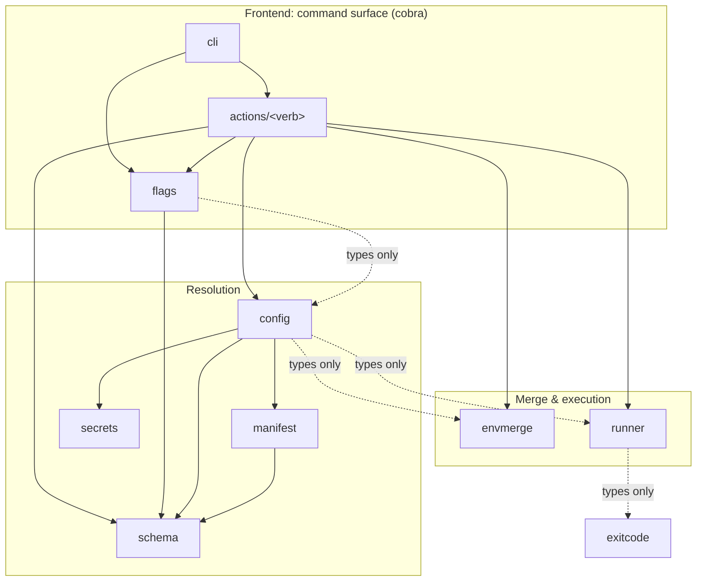
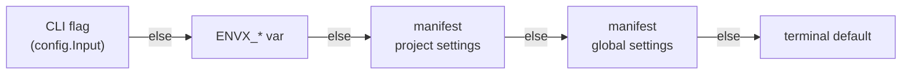

# envx: application internals

This document is the starting point for contributors working on the envx CLI. It explains how the `app/` module is organized, how packages depend on one another, and, most importantly, how a setting flows from a flag or manifest value all the way into the resolved environment.

For user-facing documentation (installation, commands, and configuration reference), see the [root README](../README.md).

## Contents

- [Getting started](#getting-started)
- [Directory structure](#directory-structure)
- [Architecture](#architecture)
- [Settings resolution](#settings-resolution)
- [Adding, changing, or removing a setting](#adding-changing-or-removing-a-setting)
- [Command surface](#command-surface)
- [Testing](#testing)
- [Conventions](#conventions)

## Getting started

All tasks run through [Task](https://taskfile.dev/) from the repository root. Run `task --list` to see everything available; the envx tasks are namespaced under `envx:`.

| Task | Purpose |
| --- | --- |
| `task envx:run -- <args>` | Run the CLI from source (`go run ./cmd/envx`) |
| `task envx:build` | Build the binary to `bin/envx` |
| `task envx:install` | Install to your Go `bin/` directory |
| `task envx:test` | Run all tests with race detector and coverage |
| `task envx:check` | Format, lint (golangci-lint v2), and scan for vulnerabilities |
| `task envx:clean` | Remove build artifacts |

> `task envx:check` runs `golangci-lint fmt` first, which **auto-formats** your
> code. Always run it before committing.

## Directory structure

```
app/
├── cmd/envx/           # main package: entry point, build-metadata vars, exit-code mapping
├── internal/           # all application logic (not importable outside the module)
│   ├── cli/            # root cobra command; registers each action and the --config flag
│   ├── actions/        # one package per command verb (the imperative shell)
│   │   ├── create/     #   scaffold an example workspace from an embedded template
│   │   ├── diff/       #   compare a project across two environments
│   │   ├── explain/    #   show each resolved value and where it came from
│   │   ├── get/        #   print one resolved value
│   │   ├── run/        #   run a child process with the merged environment
│   │   └── set/        #   write a key/value into a namespace overlay file
│   ├── config/         # resolution pipeline: meshes input + ENVX_* + manifest into a Result
│   ├── manifest/       # discover, load, parse, and validate envx.yaml
│   ├── schema/         # single source of truth: FlagSpec catalog + Manifest/Settings types
│   ├── secrets/        # resolve secret:// references against the local secrets store
│   ├── flags/          # translate schema specs into pflag flags and read them back
│   ├── envmerge/       # merge a project's namespace files into one resolved environment
│   ├── runner/         # execute a child process (env injection, signal forwarding, exit codes)
│   ├── exitcode/       # shared error type carrying a numeric exit code
│   └── fixtures/       # test-only helpers for locating testdata
├── pkg/                # small, dependency-free utilities (importable if ever needed)
│   ├── arg/            # read optional positional arguments
│   ├── file/           # filesystem helpers (read, atomic write, walk-up search, abs paths)
│   └── str/            # string helpers (dedent)
└── testdata/           # sample workspaces used by tests (see internal/fixtures)
```

Each package under `internal/` carries a `doc.go` with a package-level comment describing its responsibility in more detail; read it before changing a package.

## Architecture

envx follows an **imperative-shell / pure-core** design. The action packages are the thin imperative shell: they parse arguments, call the resolution pipeline, and render output. The heavy lifting (precedence resolution, merging, and process execution) lives in dedicated packages that take plain value inputs and are framework-agnostic (no cobra below the action layer).

Two ideas hold the design together:

- **`schema` is the single source of truth.** A setting's flag name, its `ENVX_*` fallback, and its manifest key are declared once in `schema` and read by both `flags` (registration) and `config` (resolution), so the two can never drift.
- **`config` is framework-agnostic.** It takes presence as an optional (non-nil) value rather than a flag-set handle, so the same pipeline could serve an HTTP handler tomorrow.

### Package flow



**Legend**

- **Solid arrow**: imports and uses the package's functions, methods, or values.
- **Dotted arrow**: imports for **types only**, meaning it constructs the package's structs but calls none of its functions or methods. `config` builds `envmerge.Params` and `runner.Params` without invoking either package, `flags` builds a `config.Input` without calling `config`, and `runner` returns an `exitcode.Error` value. (`config` also builds a `secrets.Settings`, but because it additionally calls `secrets.Open` that edge is solid, not dotted.)

**Notes on the collapsed `actions/<verb>` node** (each verb is its own package):

- Every verb imports `config` and `flags`.
- `get`, `run`, `explain`, and `diff` import `envmerge`; `set` does not (it edits the YAML node tree directly and never flattens).
- Only `run` imports `runner`.
- Only `explain` and `diff` import `schema` directly, for the `--output` flag spec they register themselves.

`schema` and `exitcode` are pure leaves that import only the standard library, so any layer can depend on them without risking an import cycle.

## Settings resolution

A "setting" is any knob that controls how envx loads and merges environment files (`env`, `require_overlays`, `prefix`, `suffix`, `delimiter`, `namespace_prefix`, `overload`, plus the `config` bootstrap flag). Every setting can be supplied from several places; `config` resolves them with a fixed **precedence**, highest to lowest:

1. **CLI flag**: e.g. `--env production` (an explicit, non-nil value in `config.Input`).
2. **`ENVX_*` environment variable**: e.g. `ENVX_ENV=production`.
3. **Manifest project settings**: `projects.<name>.settings` in `envx.yaml`.
4. **Manifest global settings**: the top-level `settings` block in `envx.yaml`.
5. **Terminal default**: the fallback applied last, the Go zero value for most settings (`false`, `""`, or `","` for the delimiter), and the **first declared environment** for `env`.



Resolution reads left to right and stops at the first source that supplies a value; the terminal default is used only when every earlier source is absent.

The mechanics live in [internal/config/precedence.go](internal/config/precedence.go): `precedenceString` and `precedenceBool` take the explicit value, then read the `ENVX_*` name straight from the setting's `schema.FlagSpec`, then walk the manifest layers (project before global), then fall back to the zero value. Presence is what distinguishes "explicitly set to false" from "unset", which is why booleans in `config.Input` and `schema.Settings` are `*bool`, not `bool`.

The `env` terminal default (first declared environment) is applied downstream in `envmerge.normalizeParams`, not in `config`, so the resolution pipeline stays free of behavioral defaults.

## Adding, changing, or removing a setting

Because a setting is threaded through several packages, adding one is a small but multi-file change. Use an existing setting (for example `delimiter`) as a template. Update **all** of the following:

1. **[internal/schema/flagspec.go](internal/schema/flagspec.go)**: add a `FlagSpec` var to the catalog (flag `Name`, optional `Short`, `Env` fallback, `Usage`, and any default). This is the single source of truth for the flag's identity.
2. **[internal/schema/manifest.go](internal/schema/manifest.go)**: add the field to the `Settings` struct with its `yaml` tag, keeping the fields in alphabetical order. Use `*bool` for booleans so an explicit `false` is distinguishable from unset.
3. **[internal/config/config.go](internal/config/config.go)**: add the field to `Input`, then wire it into `resolveEnvmergeParams` (settings that affect merging) or `resolveRunnerParams` (execution-only settings such as `overload`) via `precedenceString` / `precedenceBool`.
4. **The consuming engine**: add the resolved field where it is actually used:
   - Merge-time settings: [internal/envmerge/params.go](internal/envmerge/params.go) `Settings` struct, consumed in [internal/envmerge/envmerge.go](internal/envmerge/envmerge.go) / [internal/envmerge/flatten.go](internal/envmerge/flatten.go). Apply any non-zero terminal default in `normalizeParams`.
   - Execution settings: [internal/runner/params.go](internal/runner/params.go).
5. **[internal/flags/register.go](internal/flags/register.go)**: add a `WithXxx` option that registers the flag from its `FlagSpec`.
6. **[internal/flags/input.go](internal/flags/input.go)**: read the flag back into `config.Input` inside `GetInput` (via `optString` / `optBool`).
7. **[internal/actions/*/command.go](internal/actions)**: add `flags.WithXxx` to each command that should expose the flag. Not every verb registers every flag (for example `set` registers only `--env`).
8. **Tests**: cover the new setting in the affected packages: `schema` (`flagspec_test.go` asserts unique env-var names), `config` (`precedence_test.go`, `config_test.go`), `flags` (`input_test.go`, `register_test.go`), and the consuming engine (`envmerge` or `runner`).

**Changing** a setting: update its `FlagSpec` and `Settings` field, then fix the usage text, defaults, and tests. **Removing** a setting: delete it from every file above, in reverse order (start at the command registrations so nothing still references the removed spec).

Run `task envx:check` afterward; the linter's type checking catches any reference you missed.

## Command surface

Which flags each verb registers (from each `command.go`):

| Flag | get | run | set | explain | diff |
| --- | :-: | :-: | :-: | :-: | :-: |
| `--config` (persistent, all commands) | ✓ | ✓ | ✓ | ✓ | ✓ |
| `--env` / `-E` | ✓ | ✓ | ✓ | ✓ | |
| `--require-overlays` | ✓ | ✓ | | ✓ | ✓ |
| `--prefix` | ✓ | ✓ | | ✓ | ✓ |
| `--suffix` | ✓ | ✓ | | ✓ | ✓ |
| `--delimiter` | ✓ | ✓ | | ✓ | ✓ |
| `--namespace-prefix` | ✓ | ✓ | | ✓ | ✓ |
| `--overload` | | ✓ | | | |
| `--output` / `-o` | | | | ✓ | ✓ |

`diff` takes the two environments as positional arguments, so it does not register `--env`.

`create` stands apart from the resolution verbs: it scaffolds an example workspace (`create quick-start`) from a template embedded under [internal/actions/create/templates](internal/actions/create/templates) and registers only `--target-dir` and `--force`.

## Testing

- Tests run through `task envx:test` (race detector + coverage over all packages).
- Sample workspaces live under [testdata/](testdata); resolve their paths with the helpers in [internal/fixtures](internal/fixtures) (for example `fixtures.Manifest("basic")`) rather than fragile `../..` offsets.
- `envmerge` tests build `envmerge.Params` directly, so they need no manifest on disk.
- Pure kernels (merge, flatten, precedence, exit-code mapping) are table-tested; keep new logic pure where possible so it stays easy to test.

## Conventions

- **Doc comments everywhere.** Every exported and unexported func and type gets a block-header doc comment: a `// ----` divider line, a blank line, then the Go doc comment. Per-package doc comments live in each package's `doc.go`.
- **Formatting is automated.** Rely on `golangci-lint fmt` (run by `task envx:check`) for composite-literal and struct formatting rather than hand-aligning.
- **Value semantics for input structs.** A package's primary-function input is a by-value `Params` struct (`envmerge.Params`, `runner.Params`); `config.Input` is the one named exception. The linter's `hugeParam` threshold is raised to 256 bytes so these single-copy-per-command inputs stay by value.
